# CycleBay

TODO for app:
- Add robots.txt
- SEO: Add meta tags
- Add sitemap.xml
- Test error pages
- 3 Custom models
- Test stripe webhook
- Check if there is no commented code and no broken internal links
- Ensure that all pages on the site can be reached by a link from another findable page
- Add breadcrumbs
- FIXME: mailchipm icon on small screens: remove:
@media screen and (max-width: 400px)
#mc_embed_signup .foot {
    /* grid-template-columns: 1fr;
}
- Fix callout-container col-12: remove(on small screens, as it overflows the container):
padding-right: 15px;
padding-left: 15px;

## Overview
The CycleBay is a business to customer (B2C) e-commerce platform that allows customers to buy bicycles online. This is a full stack website built using the Django framework and uses the PostgreSQL database to store and manage data. The app is deployed on the Heroku cloud platform, uses the AWS S3 cloud service to store static files and utilizes the Stripe payment system to process payments.

Live Demo: https://cyclebay-bc1e75ddbf8e.herokuapp.com/


## Table of Contents

### Projects Goals
- Develop a web application enabling users to purchase bicycles online.
- Cater to cycling enthusiasts in search of a new bicycle.
- Ensure the app facilitates a quick and user-friendly bike search experience.
- Incorporate a responsive design to ensure an optimal viewing experience on various devices.
- Integrate a secure payment system.

### Marketing Strategy
CycleBay's overarching goal is to substantially increase sales and revenue. To achieve this, we are prioritizing product visibility by showcasing our range on digital platforms. Expanding our digital footprint through the creation and active management of our Facebook page will facilitate direct engagement with our target audience. Additionally, our strategic push on social media aims to grow our brand awareness, ensuring that CycleBay becomes the go-to e-commerce platform for cycling enthusiasts.

Our target audience consists of people who love cycling and are in search of a new bike. These individuals are typically very active on social media and are always on the lookout for new products and discounts. Consequently, I decided to leverage social media marketing and email marketing to promote the app. I've set up a Facebook Business Page and initiated a newsletter. The Facebook page will serve to promote the app, while the newsletters sent to subscribers will feature special offers and discounts. As the project doesn't have a budget for paid ads, I've opted for free marketing strategies.

- #### Social Media Marketing: Facebook Business Page
I chose the Facebook Business Page because it's an excellent platform for promoting the store and engaging with customers. It provides an opportunity to create a community around the business and to establish lasting relationships with our clients. Furthermore, it offers the potential to create ads and reach a broader audience in the future. I've incorporated a link to the Facebook Business Page in the footer of the store, making it convenient for users to locate and follow the page.

<small>Since the *Buy Now* call to action button is no longer available to link to an external website, I added a store link to the "About" section of the page and set *Learn More* as the call to action button.</small>

[View Facebook Business Page](https://www.facebook.com/people/CycleBay/61552069412658/)

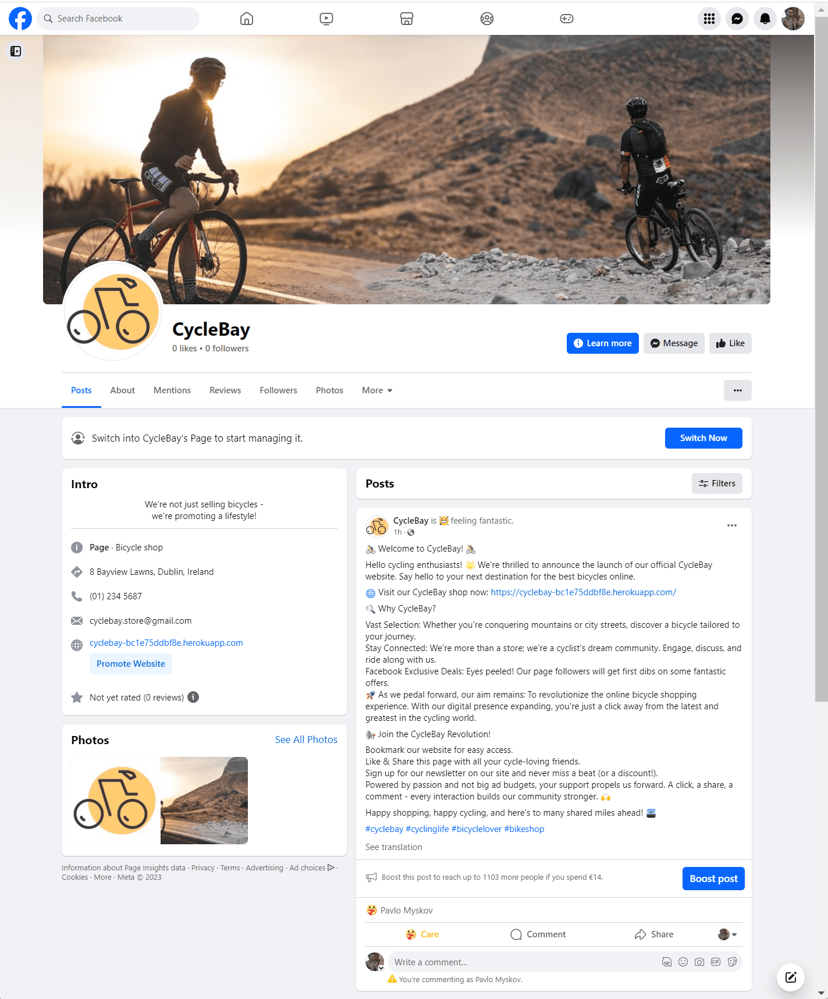

- #### Email Marketing: Newsletter
Newsletters are effective tools for maintaining regular contact with customers and updating them about special offers and discounts. I used [Mailchimp](https://mailchimp.com/) to create the newsletter. Mailchimp is a renowned email marketing service that facilitates communication with customers, clients, and other interested parties. It provides the means to curate a mailing list and dispatch newsletters to subscribers. I've set up a mailing list and embedded a subscription form in the web application. When users opt into the newsletter, their email addresses are added to the mailing list, enabling me to reach out to all subscribers. For instance, I can disseminate discount codes to entice them to finalize a purchase.

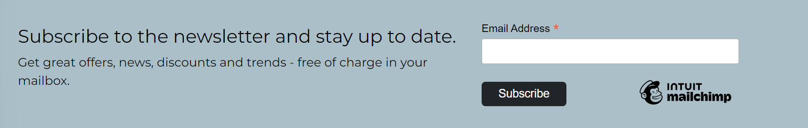
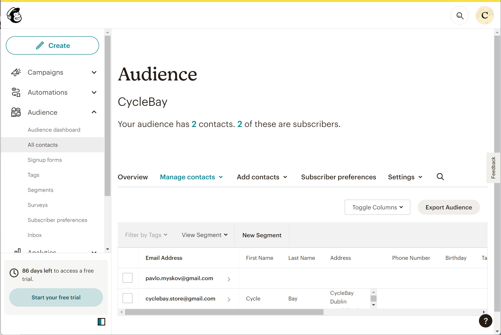


[Back to top](#table-of-contents)

## Agile Methodology
The main goal of the app is to deliver a solution that creates real value for the users and _UX design_ and _Agile Methodology_ are the best way to achieve this goal.

### Development process
This project was developed with the Agile methodology which allowed me to develop the app iteratively and incrementally, and adapt changes with flexibility even in the late stages of development.

_GitHub Issues_ and _Projects_ are used to manage the development process.

The Project link: https://github.com/users/FlashDrag/projects/11

Each siqnificant feature is presented as an _Epic_ and then broken down into smaller _User Stories_ that are then added to the _Project Backlog_. _Epics_ are marked with labels to indicate the feature. It allows me to filter the _User Stories_ by feature and then allocate them to _Milestones_ and prioritize them.

The _GitHub__ Kanban_ board is used to manage the process and track the progress of the development. When _User Story_ is created, it is automatically added to the _Backlog_ column to be prioritized. The product _Backlog_ is never complete, as it is a dynamic document to respond to changes effectively. As new features are identified, they are added to the product _Backlog_. As the product is released, the product _Backlog_ is constantly updated to reflect changes in the product and changes in the market. The Kanban board includes the following columns:
- **Backlog** - the list of all _User _Stories_ that have not yet been scheduled to be completed. As new _User Stories_ are created, they are automatically added to the _Backlog_ column.
- **Sprint Backlog** - the collection of prioritized _User Stories_ that have been selected for the current _Sprint_.
- **Development** - the user stories that are currently being developed.
- **Testing** - user stories that are currently being tested.
- **Done** - all completed and tested _User Stories_.


The Project Table is used to filter and then allocate _User Stories_ to _Milestones_ and prioritize them. At the start of each sprint, the _User_ Stories_ are selected from the _Backlog_ and added to the _Sprint Backlog_ with attached priority labels.
The _User Stories_ prioritized using the _MoSCoW_ method. The prioritization was based on the following criteria:
- **Must Have** - The _User Story_ is crucial and add significant value to the product and must be delivered in the current iteration.
- **Should Have** - The _User Story_ is important but not critical to the success. Simply delivery is not guaranteed within the current iteration.
- **Could Have** - The _User Story_ is desirable and would only be delivered in their entirety in a best-case scenario. When a problem occurs and the deadline is at risk, one or more could-have items are dropped.
- **Won't Have** - The _User Story_ will not be delivered in the current delivery timebox but may be considered for the future.
The prioritization is based on the 60-20-20 rule where 60% of the effort is spent on the Must Have, 20% on the Should Have and the rest 20% on the Could Have. When the Sprint starts, the _User Stories_ are moved to the _Development_ column, where first the Must Have items. When the development of a particular _User Story__ is completed, it is moved to the _Testing_ column, tested and then moved to the _Done_ column manually or using the _commit_ message concerning the User Story ID. If the time is running out and the _User Stories_ are not completed, the Could Have items are dropped back to the _Backlog_ column for re-prioritization.

*GitHub Kanban Board*


*GitHub Project Table*


*Milestones*


[Back to top](#table-of-contents)


#### User Stories
#### Epic: Viewing and Navigation
- As a Shopper, I want to be able to see a home page so that I can quickly understand the purpose of the site and learn more about the business
- As a Shopper, I want to be able to easily navigate throughout the site to find content so that I can find what I'm looking for efficiently
- As a Shopper, I want to be able to view a list of bikes so that I can select one to purchase
- As a Shopper, I want to be able to view the details of a bike so that I can identify the price, color, type, size and image
- As a Shopper, I want to be able to quickly identify special offers so that I can take advantage of special savings on products I'd like to purchase
- As a Shopper, I want to be able to easily view the total of my purchases at any time so that I can avoid spending too much
- As a Shopper, I want to be able to contact the store owner using the contact form so that I can ask any questions I may have
#### Epic: Registration and User Accounts
- As a Shopper, I want to be able to easily register for an account so that I can have a personal account and be able to view my profile
- As a Shopper, I want to be able to easily login or logout so that I can access my personal account information
- As a Shopper, I want to be able to easily recover my password in case I forget it so that I can recover access to my account
- As a Shopper, I want to be able to receive an email confirmation after registering so that I can verify that my account registration was successful
#### Epic: User Profile and Purchases
- As a Shopper, I want to be able to have a personalized user profile so that I can view my personal order history and order confirmations, and save my payment information
- As a Shopper, I want to be able to save the products I want to buy later so that I can keep track of them
- As a Shopper, I want to be able to view my wish list so that I can see what I want to buy later
#### Epic: Sorting and Searching
- As a Site User, I want to be able to sort the list of available products so that I can easily identify the best-priced, categorically, brandly and colored products
- As a Shopper, I want to be able to sort a specific category of products so that I can find the best-priced product in a specific category or sort the products in that category by name
- As a Shopper, I want to be able to use filters so that I can sort multiple categories, brands, colors, price and sizes of products simultaneously
- As a Shopper, I want to be able to search for a product by name, brand or color so that I can find a specific product I'd like to purchase
- As a Shopper, I want to be able to easily see what I've searched for and the number of results so that I can quickly decide whether the product I want is available
#### Epic: Purchasing and Checkout
- As a Shopper, I want to be able to easily select the size and quantity of a bike when purchasing it, so that I can ensure I don't accidentally select the wrong bike, size or quantity
- As a Shopper, I want to be able to view bikes in my bag to be purchased, so that I can identify the total cost of my purchase and all items I will receive
- As a Shopper, I want to be able to adjust the quantity of individual items in my bag, so that I can easily make changes to my purchase before checkout
- As a Shopper, I want to be able to remove a Bike from my bag, so that I can remove it if I change my mind
- As a Shopper, I want to be able to easily enter my payment information so that I can check out quickly and with no hassles
- As a Shopper, I want to be able to feel my personal and payment information is safe and secure so that I can confidently provide the needed information to make a purchase
- As a Shopper, I want to be able to view an order confirmation after checkout, so that I can verify I haven't made any mistakes
- As a Shopper, I want to be able to receive an email confirmation after checking out, so that I can keep the confirmation of what I've purchased for my records
#### Epic: Newsletters and Social Media
- As a Shopper, I want to be able to subscribe to a Newsletter so that I can receive any discounts or special offers available.
- As a Store Owner, I want to be able to send a newsletter to subscribers, so that I can inform them about special offers or discounts.
- As a Store Owner, I need a Facebook page, so that I can promote my store on social media.
#### Epic: Store Management
- As a Store Owner, I want to be able to add a product to the store, so that I can sell it to customers.
- As a Store Owner, I want to be able to edit/update a product, so that I can change the price, image or any other attributes of the product.
- As a Store Owner, I want to be able to delete a product, so that I can remove it from the store.
- As a Store Owner, I want to be able to add a product category, so that users can group products into categories.
- As a Store Owner, I want to be able to add a product brand, so that users can group products into brands.
- As a Store Owner, I want to be able to add a product color, so that users can group products into colors.

[Back to top](#table-of-contents)

## UX Design
The CycleBay website is designed to be simple and easy to navigate. The site has a responsive design to provide an optimal viewing experience across a wide range of devices.

### Site Structure
The website has 4 main pages with a clear and semantic structure, the information is well organized, every element is easy to find. The consistency and similarity of the structure is manifested on all pages and sections of the site and covers interactivity.

### Wireframes
The wireframes were created using [Balsamiq](https://balsamiq.com/). Here are some initial wireframes created at the beginning of the project. The final design may differ from the initial wireframes.

<!-- TODO add wireframes -->

[Back to top](#table-of-contents)

### Design Choices
#### Color Scheme
The color theme of the website is inspired by the colors of the hero image "Teal and Orange". The hero image is a picture of a person riding a bicycle. The colors of the image background are cyan and black, and the color of the person's skin closes to warm orange. This combination of colors is very popular in the film industry and is used to create a cinematic look. This color contrast is also rooted in color theory, where the two colors are almost opposite on the color wheel, making them complementary. The teal and orange moslty used for interactive elements, such as buttons, links, and icons. The black, gray and white colors are used for text and backgrounds, to create a high contrast and ensure readability.

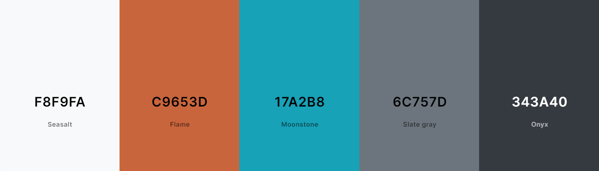

#### Typography
As a primary font, I have chosen to use the [Montserrat](https://fonts.google.com/specimen/Montserrat) font. It's a geometric sans-serif typeface that is easy to read and invokes a feeling of trust. Since it's designed for fast reading, it's good for product descriptions, and its aesthetic is appealing to the creatives, and businessmen alike.

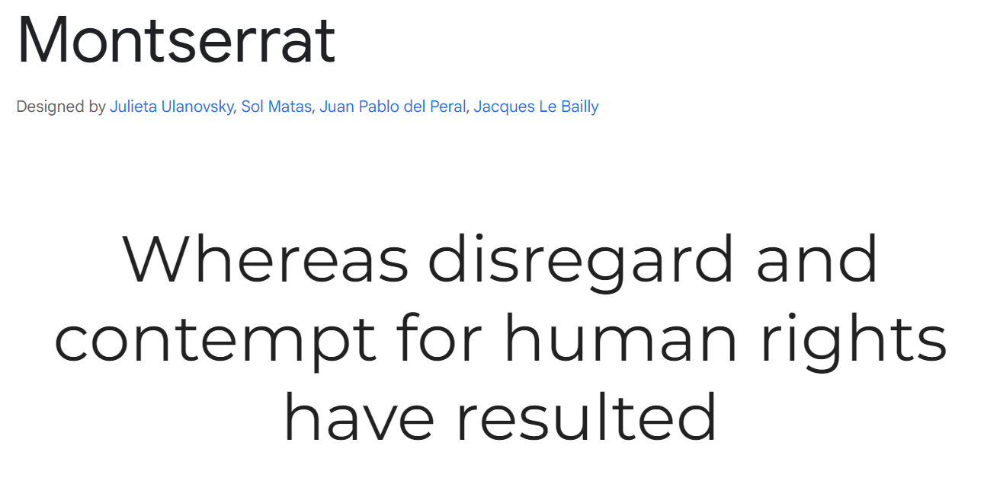

[Back to top](#table-of-contents)

### Database Design
The Get Job platform uses a relational database to store and manage data. The RDBMS used for this project is [PostgreSQL](https://www.postgresql.org/) which is hosted on the cloud service [ElephantSQL](https://www.elephantsql.com/).

The ER Diagram below shows the structure of the database and the relationships between the tables. This diagram was created using [Microsoft Visio](https://www.microsoft.com/en-ie/microsoft-365/visio/).

<!-- TODO add db scheme -->


[Back to top](#table-of-contents)

## Features

### Common Features
#### Navbar
The navbar is fully responsive and collapses into a hamburger menu on smaller screens. The right side of the navbar is always visible on all screens, since it contains the most important links for the user. I didn't see the point to make the navbar sticky or fixed, since the page content is not too long, except the products page, but in this case the user can use the *Back to top* button. In some cases, the fixed navbar can be annoying and distract the user from the main goal.

The navbar consists of two horizontal sections:

- The top section is narrow and contains on left side the *Join us on Facebook* link that opens the Facebook page in a new tab. On the right side, there are *Login* and *Register* links. If a user is authenticated, the *Login* and *Register* links are replaced with the *Profile*<small>(for staff only)</small> and *Logout* links.

- The bottom section is main navbar and contains the *CycleBay* logo and the following links on the left side: *Home*, *All Bikes* dropdown menu with the list of sorting options, *Categories* dropdown menu, *Special Offers* and *Contact Us* links. On the right side, there are *Search bar* that folds into a search icon on smaller screens, *Wishlist* link, *Profile*<small>(for customers only)</small> and *Add Item*<small>(for staff only)</small> links, and *Shopping Bag* link with the total sum of the bag.

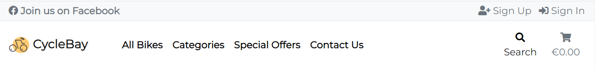
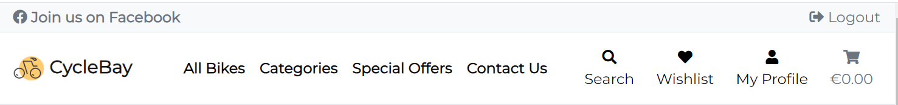

The **search bar** is visible only on extra large screens(1200px and up), and on smaller screens it collapsed into a search icon and can be expanded right under the navbar by clicking on icon. It also can be expanded even if the navbar is expanded as well.

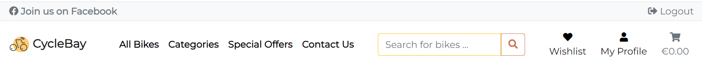
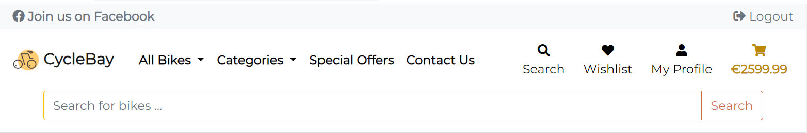

The **All Bikes** dropdown menu contains the list of sorting options. It allows the user to sort the products by price, color, brand and category names in ascending order.

The **Categories** dropdown menu contains the list of all existing categories. The category list is dynamic and generated from the database. When a new category is added to the database, it will be automatically added to the navbar dropdown menu. The user can click on the category name to view all products related to this category.

| Navbar Mobile | Navbar Mobile Search Expanded |
|:---:|:---:|
|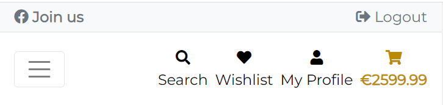|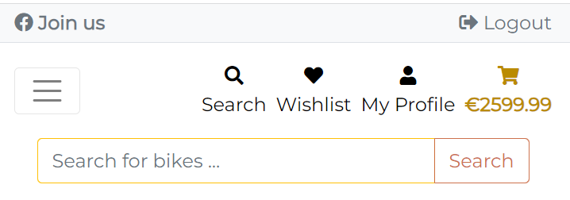|

| Navbar Mobile Expanded | Navbar Mobile Expanded & Search |
|:---:|:---:|
|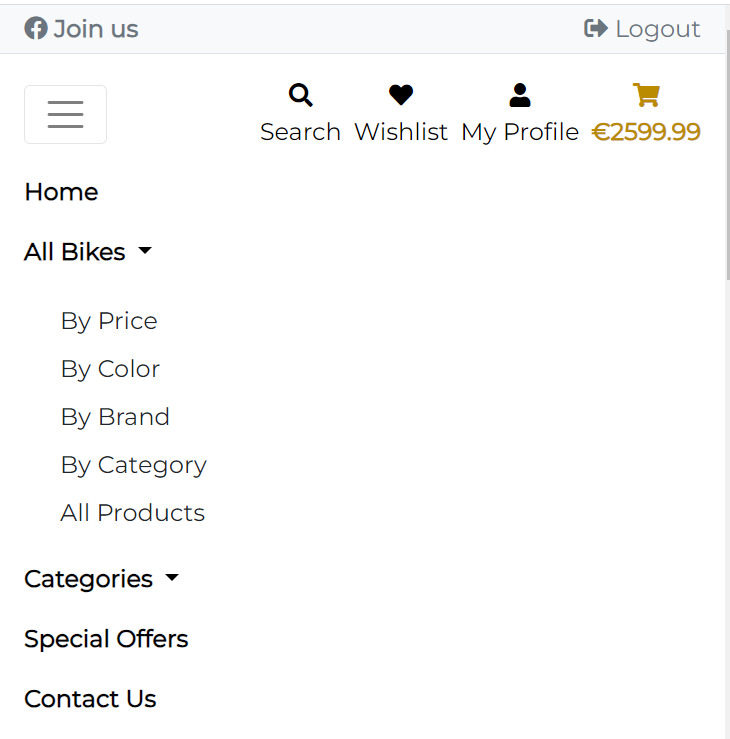|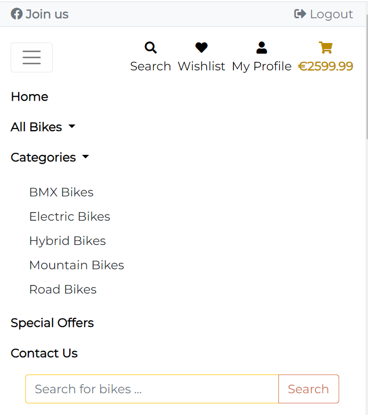|


#### Footer
The footer consists of 5 sections:

- Contact Us
The Contact Us header is a link to the contact page. The section also contains the physical address of the store.
- Social
The Social section contains the link to the Facebook page and the Facebook icon.
- Payment
The Payment section contains the Stripe logo with a link to the Stripe website and the icons of the payment methods accepted by the store, such as Visa, MasterCard, American Express.
- Privacy and Shipping Policy
- Developer Info

The footer is fully responsive and changes its layout from 3 columns to 1 column on smaller screens.

It also always stays at the bottom of the page, even if the page content is not long enough to fill the screen. This is achieved by using the `d-flex flex-column vh-100` bootstrap classes on the `body` tag and `flex-grow-1` bootstrap class on the child elements of the `body` tag on all pages where the content is long enough to fill the screen.

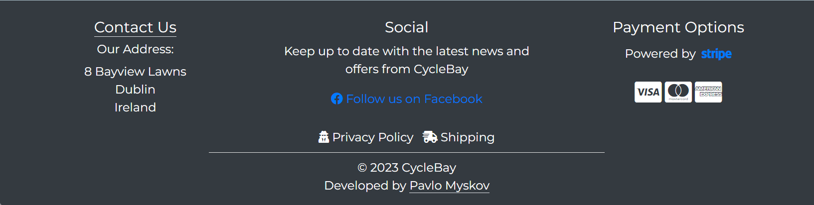


#### Contact Page
The Contact page is designed to provide the user with a convenient way to contact the store owner. The page can be accessed by clicking on the *Contact Us* link in the footer or from the navbar. The contact form contains name, email, phone number, subject and message fields. If the user authenticated, the name and email fields will be pre-filled with the user's name and email address. The form is built with Django forms and validated on the server side.

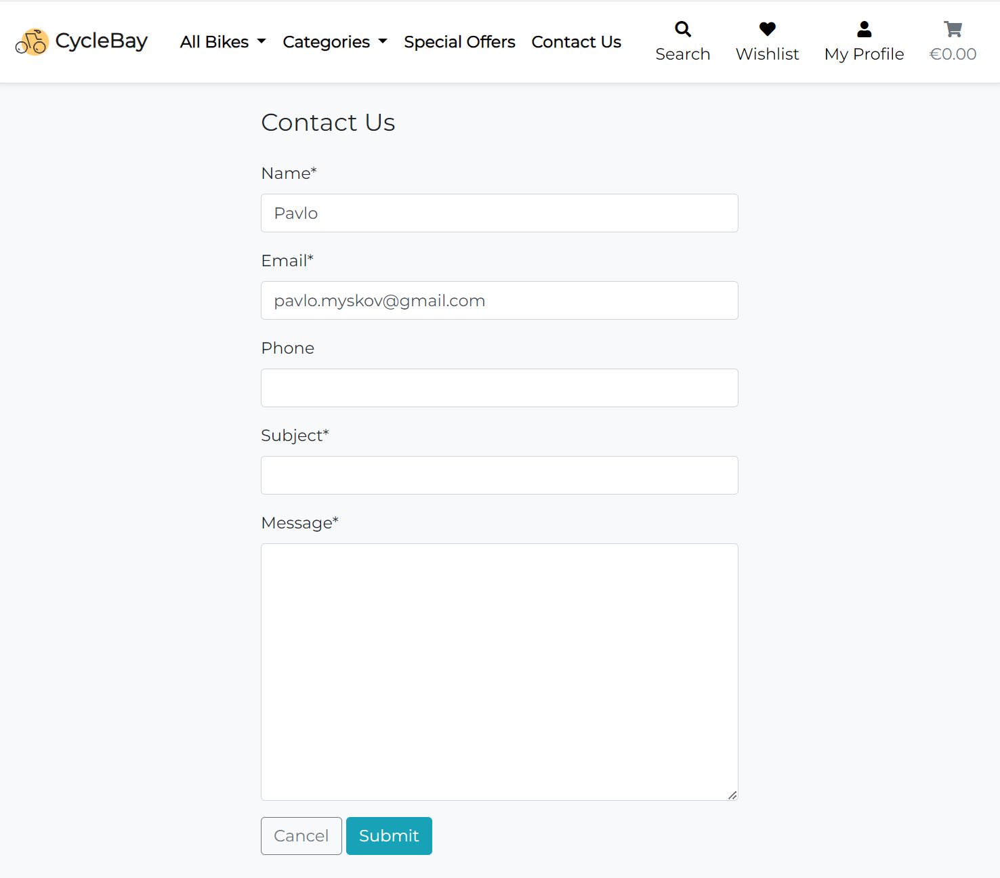

Once the user submits the form, they will be redirected to the *Home* page and will see the success message. The form data will be sent to the store owner's email address using the `django.core.mail.send_mail` method.

```
# home.views.contact

# ...
if form.is_valid():
    message = (
        f"Contact Form Message\n\n"
        f"Name: {form.cleaned_data['name']}\n"
        f"Phone: {form.cleaned_data['phone']}\n"
        f"From Email: {form.cleaned_data['email']}\n\n"
        f"{form.cleaned_data['message']}"
    )
    send_mail(
        subject=form.cleaned_data["subject"],
        message=message,
        from_email=form.cleaned_data["email"],
        recipient_list=[settings.DEFAULT_FROM_EMAIL],
        fail_silently=False,
    )
    messages.success(
        request,
        "Thank you for your message. We will get back to you soon.",
    )
    return redirect("home")
```

### Wishlist Page
The Wishlist page displays all products added to the wishlist. The list of products is sorted by name in ascending order by default.

Each product card includes Product Image, Name, Color, Price and Control Buttons. The user can remove the product from the wishlist by clicking on the *Remove* button. This functionality is implemented with **Defensive Design**. It uses the jQuery `wishlist_toggler` function to remove the product from the wishlist without reloading the page. When the user clicks on the *Remove* button, the browser will display a modal window with a warning message. The user will have to confirm the deletion. This will prevent accidental deletion of the product. Only post requests are accepted for deletion, which is implemented by the `@require_POST` decorator and jquery ajax post method.

The Wishlist Toggler can be found in the `wishlist/static/wishlist/js/wishlist_toggler.js` and `wishlist/views.py` files.

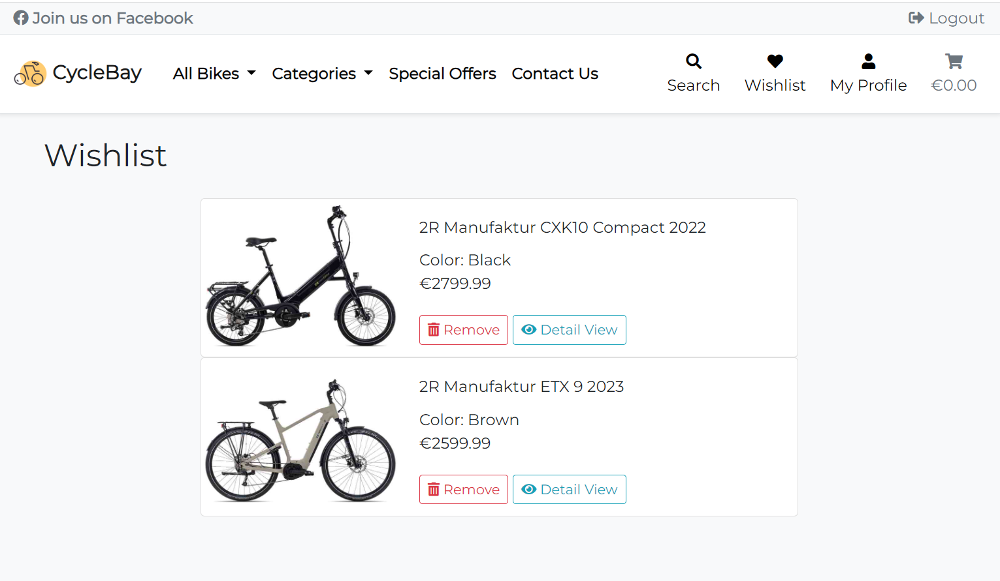
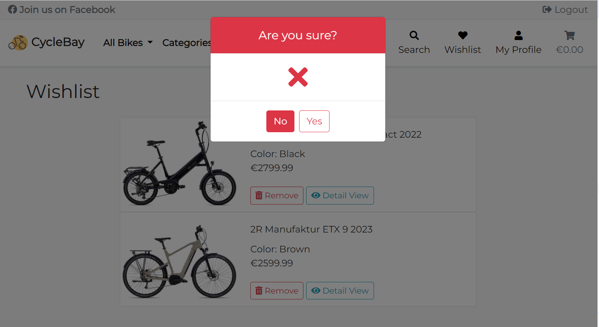
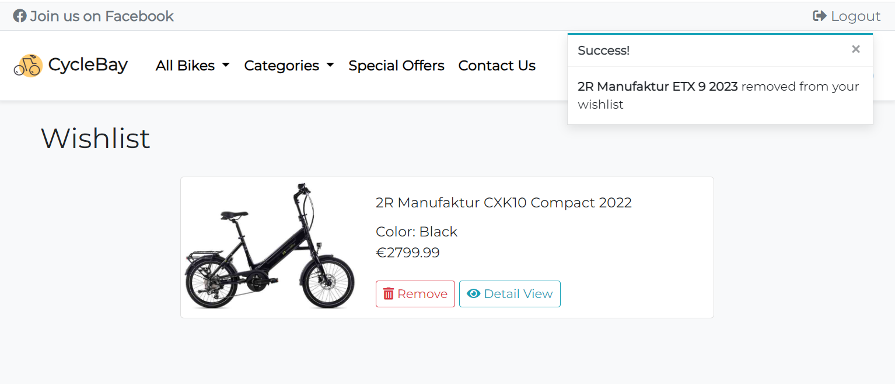

#### User Authentication and Authorization
- ##### Sign Up
The user can register a new account by clicking on the *Register* link in the navbar. The user will be redirected to the registration page where they can fill in the registration form. I implemented the custom user model that allows to use email as a username, and removed the username field from the form, since the email address is unique and can be used as a username. The user can register with real email address only, since the email address will be used for the order confirmation and password reset.

The own account allows users to view the order history, save and edit the delivery information and save and view products in a wishlist.

###### Password validation
Django by default has a good set of password validators. The goal of the validators is to ensure that a password is not a simple set of characters that can be easily a victim of a brute-force or dictionary attack.

Django includes a set of built-in password validators that check for the following rules:
- Similarity of the password and username;
- Minimum length of the password;
- Password similar to common passwords (20.000 records);
- Password not entirely numeric;

The password validators are defined in the `settings.py` file:
```
AUTH_PASSWORD_VALIDATORS = [
    {
        "NAME": "django.contrib.auth.password_validation.UserAttributeSimilarityValidator",
    },
    {
        "NAME": "django.contrib.auth.password_validation.MinimumLengthValidator",
    },
    {
        "NAME": "django.contrib.auth.password_validation.CommonPasswordValidator",
    },
    {
        "NAME": "django.contrib.auth.password_validation.NumericPasswordValidator",
    },
]
```
If the password fails to meet any of the above requirements, the user will see the appropriate error message.
<p align="center">
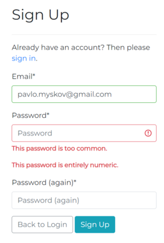
</p>

Additionally, I added a simple frontend validation to the registration form. The password must be at least 8 characters long and the second password field must match the first one. If the form is invalid, the invalid fields will be highlighted in red without reloading the page. In the future, I plan to make the client-side validation more advanced and add the password strength meter.

The jQuery password validation is implemented in the `templates/account/signup.html` template.

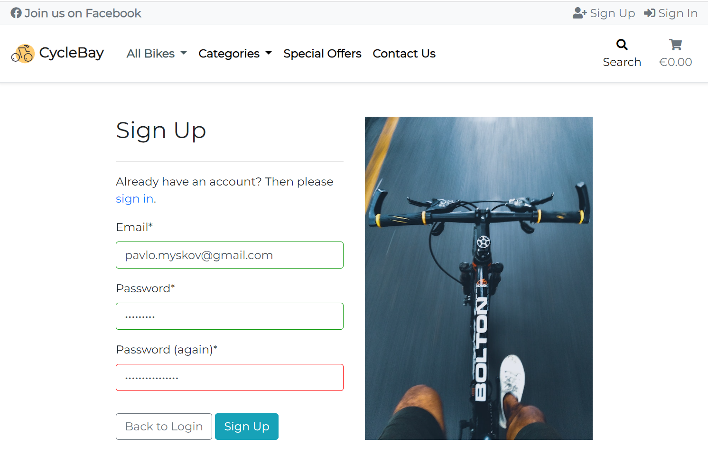

Once the all fields are filled in correctly, the user can click the *Sign Up* button to submit the form. They will be redirected to the *Verification Sent* page and will receive a confirmation email with a link to confirm the registration. Then the user click the link and will be redirected to the home page as authenticated user. So the user can start shopping right away, without the need to login again. This is achieved by using the `ACCOUNT_LOGIN_ON_EMAIL_CONFIRMATION = True` and `ACCOUNT_CONFIRM_EMAIL_ON_GET = True` setting in the `settings.py` file.

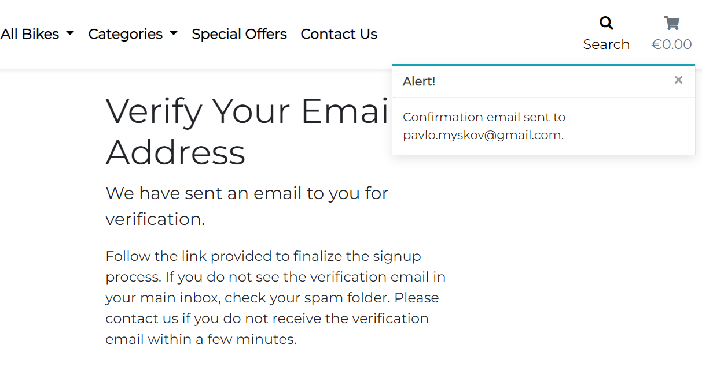
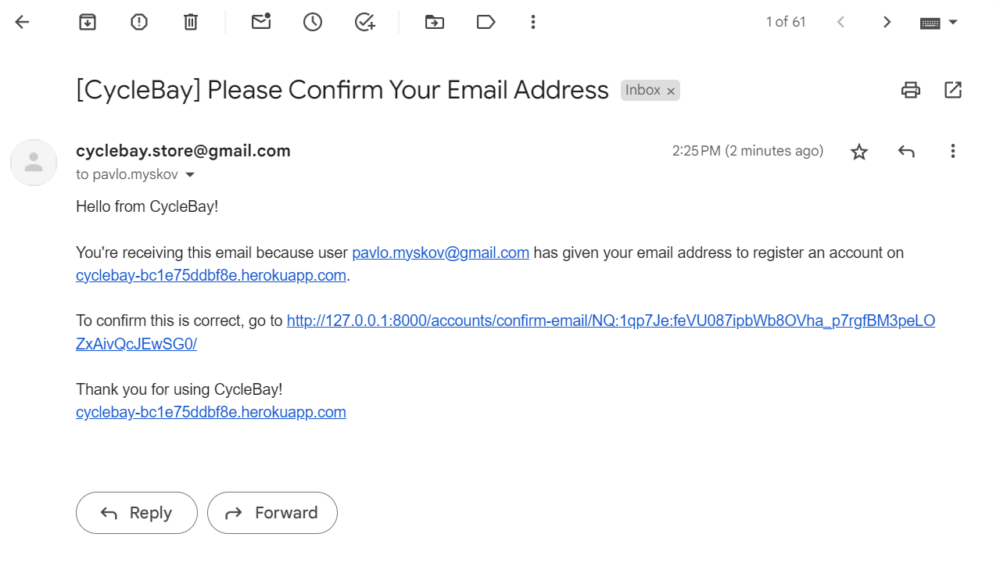
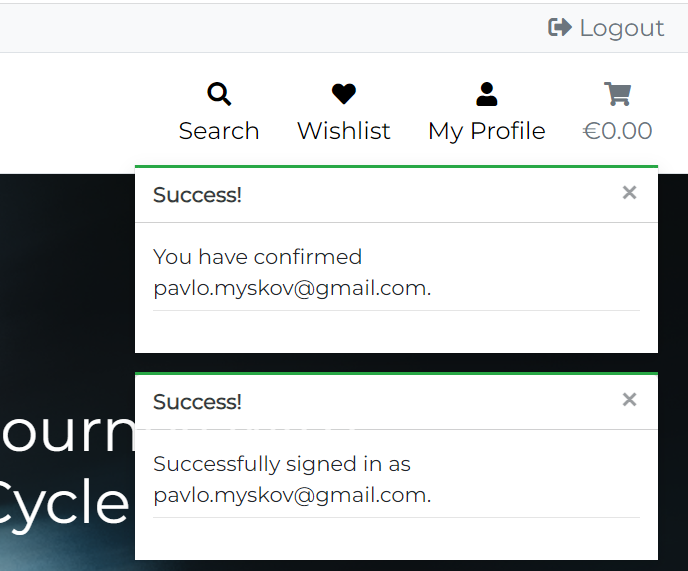

Once the user is successfully registered, the User Profile and WishList are created for this user automatically. This feature is implemented using the `post_save` signal. It allows to ensure that every user has a profile and a wishlist.

```
# wishlist/models.py

@receiver(post_save, sender=get_user_model())
def create_wishlist(sender, instance, created, **kwargs):
    if created:
        Wishlist.objects.create(user=instance)
```

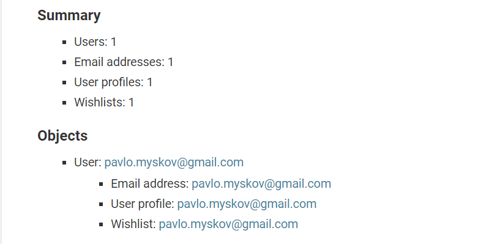

- ##### Login
The user can login by clicking on the *Login* link in the navbar. Then they will be redirected to the login page where they can fill in the login form. The user can also use the *Remember Me* checkbox to stay logged in even after closing the browser. This is achieved with the `SESSION_COOKIE_AGE` setting. By default it's 1209600 (2 weeks, in seconds).

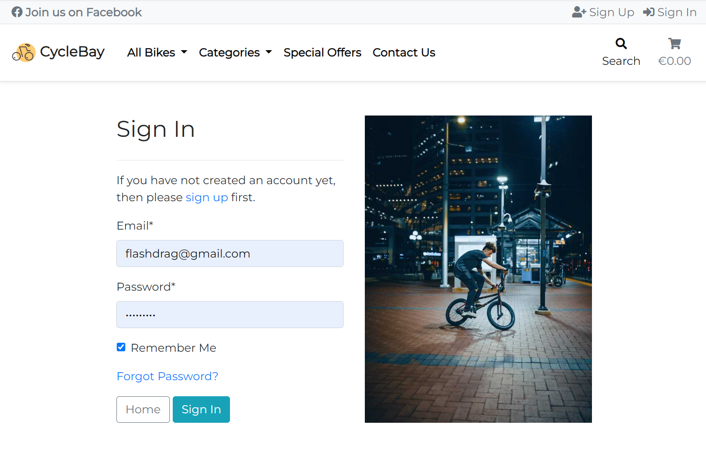

- ###### Password Reset
The user can also use the *Forgot Password?* link to reset the password. The user will receive an email with a link to reset the password. Once the user click the link, they will be redirected to the password reset page where they can enter a new password.

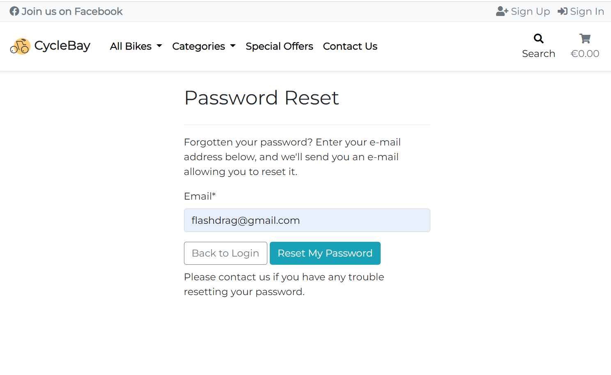
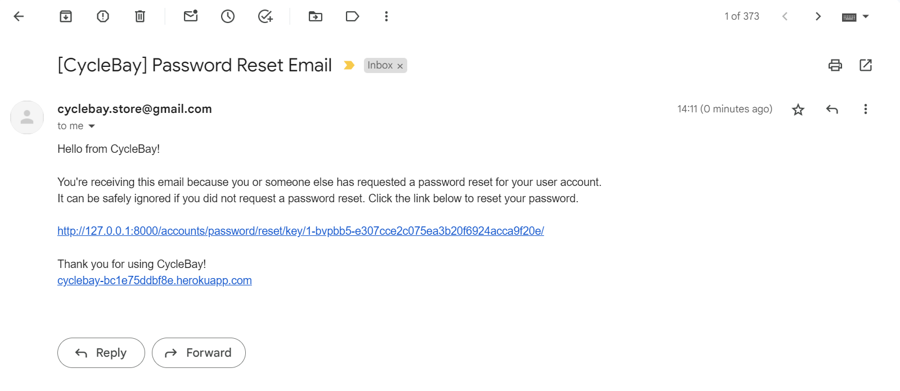
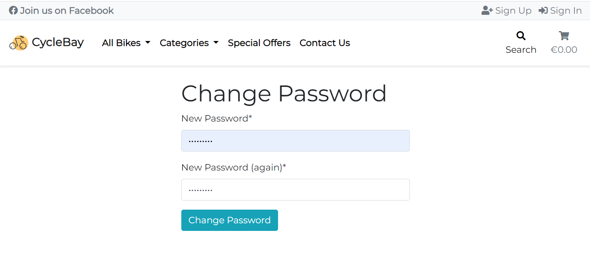

[Back to top](#table-of-contents)

### Home Page
The Home page is the landing page of the website. It provides a brief overview of the store and showcases the featured products.
- ##### Callout
The callout section is a hero image with a call to action button. The image is a picture of a woman riding a bicycle. I edited the image in Photoshop to make it fit better on the site. Using the AI generative fill tool, I exended the height of the image background, since it has fixed position and doesn't scroll with the page, so the image should be long enough to fit on all screens. I also flipped the image horizontally so the cyclist is facing to the right, which is the direction of the call to action button. This is a common technique called "F-shaped pattern", that helps to guide the user's gaze through natural sight patterns. Also I blurred the background to make the cyclist dynamic and stand out from the background. The callout section is fully responsive and the image right side is cropped on smaller screens.

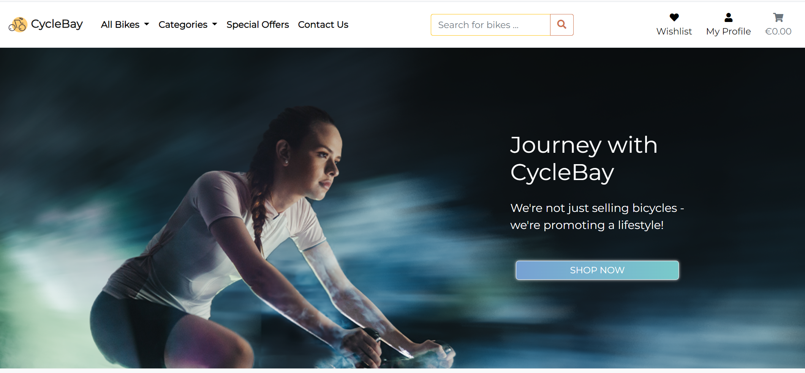

- ##### Value Proposition
The Value Proposition section aims to highlight the primary benefits and unique selling points of shopping with CycleBay. It's designed to instill confidence in potential customers by emphasizing the superior value and assurance they get when choosing CycleBay. The section showcases four visually appealing cards, each signifying a unique value proposition.

- Best Value for Money - Emphasizes that the bicycles sold on CycleBay provide the utmost value, balancing both quality and cost
- Individual size consulting - Highlights the importance of choosing the right size of a bicycle and the fact that CycleBay offers a free size consultation to ensure the customer gets the right size
- 5-Year Warranty - Assures customers of a long-term warranty, signifying the durability and trustworthiness of our products.
- Certified Quality -  Indicates that the products have undergone rigorous quality checks and have been certified by relevant authorities or institutions.

For each card, I used the [Font Awesome](https://fontawesome.com/) icons to visually reinforce the value proposition mentioned in the corresponding text.

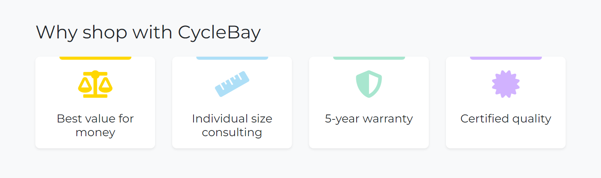

As for *assistive technologies*, the textual content ("Best value for money", "5-year warranty", etc.) itself is clear and descriptive enough for users to understand the value proposition without needing the icons. Therefore, I decided to hide the icons from screen readers by adding `aria-hidden="true"` to the `<i>` tags. This ensures that the icons are not read out by screen readers, thereby preventing any confusion.

- ##### Featured Carousel
This section is designed to showcase a rotating carousel of featured products titled "Top Selections". The Featured Carousel aims to draw attention to a curated selection of standout products, enticing visitors to explore these highlighted items.

The main content consists of a carousel showcasing individual products. Each product card displays:
- A top corner ribbon indicating the product price.
- An image of the product. If no image is provided, a default placeholder image (noimage.png) is shown.
- Below the image, the product name is displayed centered on the card.

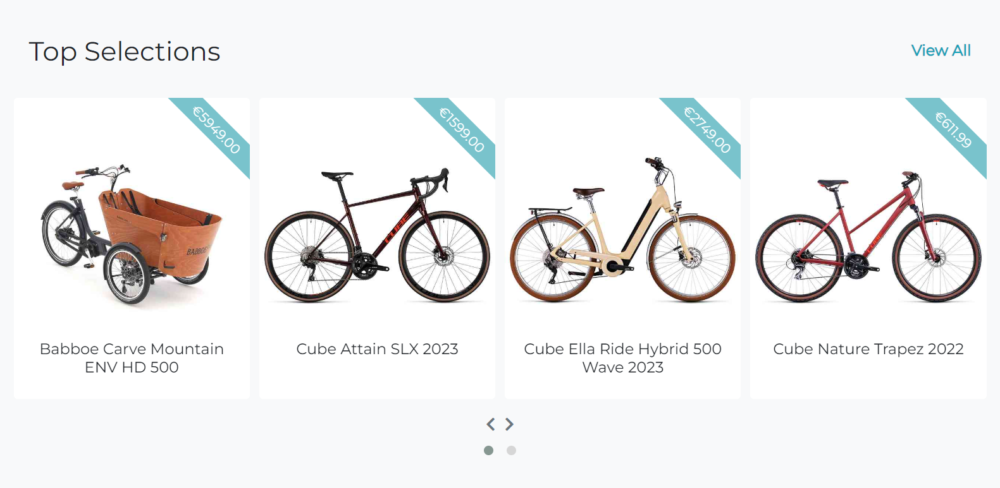

All cards are clickable and redirect the user to the product details page. Also I added the *View All* button that allows the user to view all featured products on the products page.

The carousel is fully responsive and collapses into a single element on smaller screens. The card sizes are adjusted to ensure that the cards are of equal height and width, thereby creating a uniform and visually appealing layout.

To implement the carousel, I used the [Owl Carousel](https://owlcarousel2.github.io/OwlCarousel2/) jQuery plugin. This plugin is deprecated, but it still provides the smooth and responsive carousel functionality that I was looking for. It's pretty easy to customize and has a lot of options to play with. I used the `autoplay`, `autoplayHoverPause`, `loop`, and `responsive` options to achieve the desired functionality. Also I used the `animateOut` option in combination with *animate.css* library to add the `rotateOutDownRight` animation to the cards which provides a nice transition effect when the card is removed from the carousel on smaller screens.
<p align="center">
    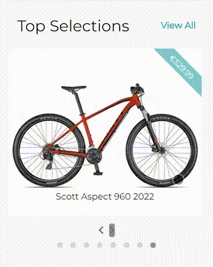
</p>

- ##### Newsletter
The Newsletter section is designed to encourage visitors to subscribe to the newsletter. The section contains a brief description of the newsletter and a subscription form. The subscription form consists of a single input field for the email address and a *Subscribe* button. The form is validated using the [Mailchimp](https://mailchimp.com/) API.

To learn more, please refer to the [Email Marketing: Newsletter](#email-marketing-newsletter) section.

[Back to top](#table-of-contents)

### Products Page
The Products page displays all bikes available in the store. The list of bikes is sorted by name in ascending order by default.

- #### Products Header
The products header consists of 3 rows:

- *Bikes* - heading
- *Current Category, Brand and Color*
- *Products Count* and *Sorting*.

- ##### Current Category, Brand and Color
This row is hidden if the user is on the *All Bikes* page. If the user is selected a category, brand or color, the *Current Category, Brand and Color* row will be displayed with appropriate values.

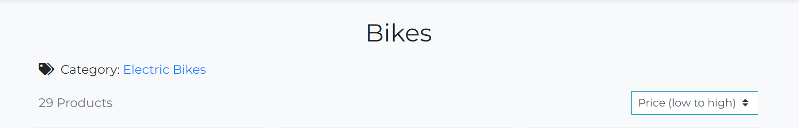

- ##### Sorting
The sorting functionality allows users to sort the bikes by price, name, category, brand and color names in ascending and descending order. It implemented using the jQuery `change` event listener on client side and Django `order_by` method on server side in the `products/views/all_products` view. When the user selects the sorting option, jQuery builds the url with the selected sorting option and replaces the current url with the new one using `window.location.replace`. Then the Django `all_products` view processes the get request with the selected sorting option, sorts the bikes and renders the page with the results.

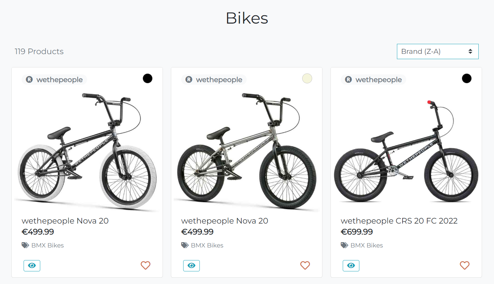

- ##### Search
The search functionality allows users to search for a bike by name and brand. It implemented using the `icontains` lookup that performs a case-insensitive containment test. It's a good choice for searching for a nike by name and brand, since the user can enter the search query in any case and the search will still work.

```
# products/views/all_products view

if "q" in request.GET:
    # get the search query
    query = request.GET["q"]
    if not query.strip():
        messages.error(
            request, "You didn't enter any search criteria!"
        )
        return redirect(reverse("products"))
    # look for the query in the product name or brand name
    queries = (
        Q(name__icontains=query)
        | Q(brand__name__icontains=query)
    )
    products = products.filter(queries)

```
The search results are displayed on the products page. Additionally, the user can see the number of products found and the given search query. The search results are sorted by name in ascending order by default, but the user can change it using the sorting functionality.

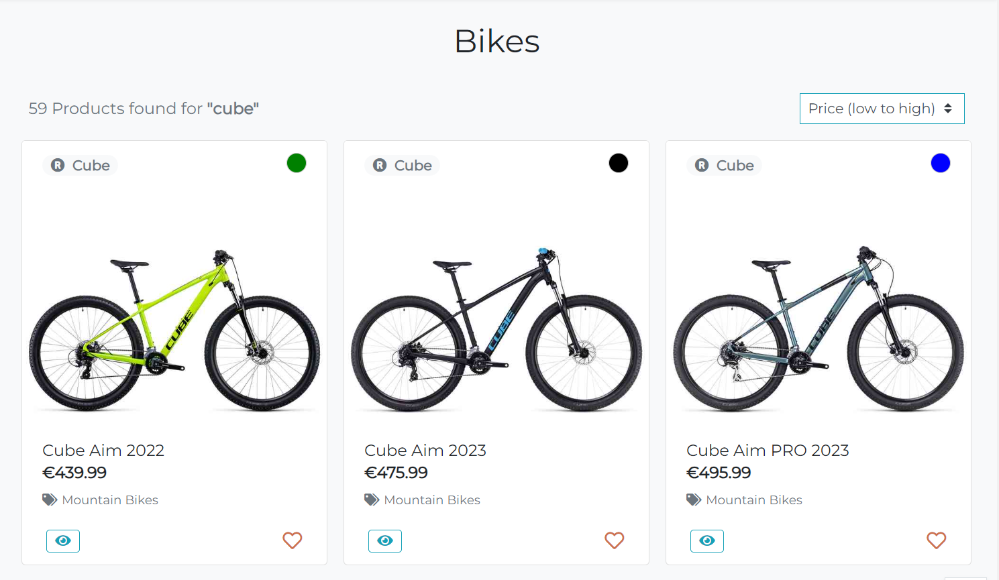

If the search query is empty, the user will see the error message and all bikes will be displayed.

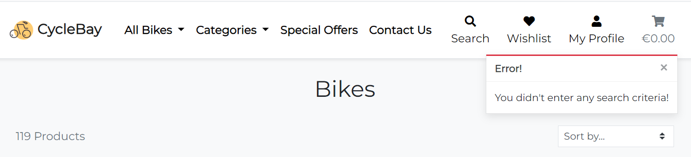

- #### Product Cards
The product cards are displayed in a grid layout. The layout consists of 4 columns on extra large screens, 3 columns on large screens, 2 columns on medium screens and 1 column on small screens.

Each product card displays:
##### Header
- Brand badge - clickable link that redirects the user to the products page with the selected brand.
- Color badge - clickable link that redirects the user to the products page with the selected color. Since the colors stored in the database as hex values, I created a JavaScript function that parses the hex value and replace `#` with `%23` to pass hex color in url, since `#` is a special character in url and it will be ignored by the browser. It allows to sort the products by specific color.

```
// products/templates/products/products.html
const parsedColor = color.startsWith('#') ? color.replace("#", "%23") : color;
```

##### Body
- Product image - clickable link that redirects the user to the product details page.
- Product name
- Product price
- Product Category - clickable link that redirects the user to the products page with the selected category.
##### Footer
- View Product icon - clickable button that redirects the user to the product details page. Since the button is not contain any text, I added the `aria-label` attribute to make it accessible for screen readers. Also if the product is out of stock, the button will be replaced with the *Out of Stock* text. The functionality implemented using the `total_count` method in the `Product` model. So, if I need to check if the product is in stock, I just call the `total_count` method on the product object in the template.
- Add to Wishlist icon - clickable button that adds the product to the wishlist. If the user is not authenticated, they will be redirected to the login page.

The *Add to Wishlist* functionality is implemented using the jQuery `wishlist_toggler` function. It allows the user to add or remove the product from the wishlist without reloading the page. The function sends the post request to the server with the product id and csrf token. Then the Django `wishlist_toggler` view processes the request and adds or removes the product from the wishlist. The view returns an `is_in_wishlist` boolean value that indicates if the product is in the wishlist or not. Then the jQuery function updates the wishlist icon and shows the appropriate message to the user.

The Wishlist Toggler can be found in the `wishlist/static/wishlist/js/wishlist_toggler.js` and `wishlist/views.py` files.

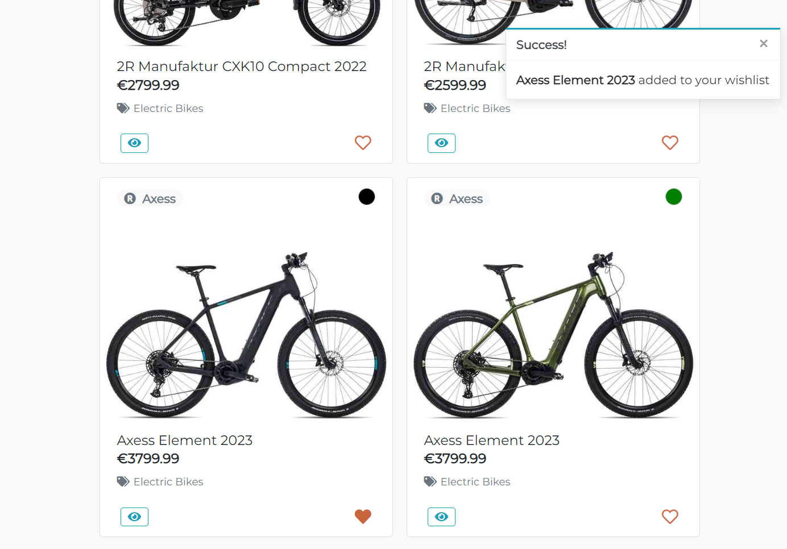

- Edit | Delete - clickable links that allow the staff to edit or delete the product. The links are visible only for staff users. If the user still tries to access the edit or delete page using the url, the error message will be displayed and the user will be redirected to the home page.

The delete functionality is implemented using **Defensive Design**. When the staff user tries to delete the product, the browser will display a modal window with a warning message. The staff user will have to confirm the deletion. This will prevent accidental deletion of the product.

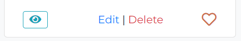

### Product Details Page
The Product Details page provides detailed information about a specific product.
It includes the product image, name, price, brand, category, color, sizes and controls.

- Image is clickable and opens the full size image in a new tab.
- Brand, category and color names are clickable and redirect the user to the products page with the selected brand, category or color.
- Edit | Delete - clickable links that allow the staff to edit or delete the product. The links are visible and available only for staff users.

The Delete functionality is implemented using **Defensive Design**.

The color is displayed as a friendly name, but passed to the link as a hex value. So, if the user clicks on the color name, the products page will be opened with the selected color. Since the colors stored in the database as hex values, I created a custom template filter `encode_query_param` based on `urllib.parse.quote_plus` function that encodes the value to be used as a query parameter. For example, the color `#ff0000` will be encoded to `%23ff0000`, that allows to pass hex color in url.

```
# products/templatetags/custom_filters.py

from django import template
from urllib.parse import quote_plus

register = template.Library()

@register.filter(name="encode_query_param")
def encode_query_param(value):
    return quote_plus(value)
```

- Sizes
This functionality is based on complex many-to-many relationships between the `Product`, `Size` and `ProductSize` models. The `ProductSize` model is an intermediate model that allows to store additional information about the product size, such as quantity. The `ProductSize` model has a foreign key to the `Product` and `Size` models. The `Product` model has a many-to-many relationship with the `Size` model through the `ProductSize` model. This allows to add multiple sizes to the product and store the quantity for each size.

```
class ProductSize(models.Model):
    size = models.ForeignKey(Size, on_delete=models.CASCADE)
    product = models.ForeignKey(Product, on_delete=models.CASCADE)
    count = models.IntegerField(
        default=0, validators=[MinValueValidator(0), MaxValueValidator(999)]
    )

    class Meta:
        # ensure that the combination of size and product is unique
        unique_together = ("size", "product")
        ordering = ["size"]

    def __str__(self) -> str:
        return f"{self.product.name} - {self.size.name}"
```


Also I added the `total_count` method to the `Product` model that returns the total count of all sizes of a specific product.

```
class Product(TimeStampModel):
# ...
    def total_count(self):
        return ProductSize.objects.filter(product=self).aggregate(
            total=models.Sum("count")
        )["total"]
```

To display the sizes to the user, first the app checks if the total count of all sizes is greater than 0. If the total count is 0, the user will see the *Out of Stock* text and the *Add to Bag* button will be disabled.

If the total count is greater than 0, the app will display the existing sizes and the quantity for each size. If a particular size was added to the product by the staff with 0 count or the size stock was out, the appropriate size button will be disabled, and the user will see the tooltip with the *Out of Stock* text on hover. Otherwise, the user can see the quantity for each size on hover, and Add to Bag the product with the selected size.

If the user not selected the size, and clicks on the *Add to Bag* button, the app will display the error message *Please select a size*. The error message is displayed using the jQuery script, that allows to validate the form without reloading the page.

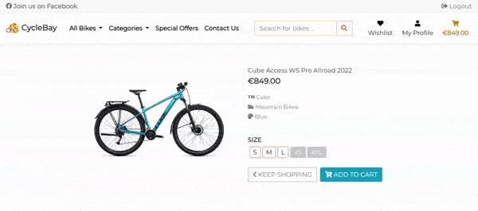

Once the user selects the size and clicks on the *Add to Bag* button, the app will send the post request to the server with the product id, size id and csrf token.

Since I implemented the **stock management** functionality, there are several possible scenarios when the user clicks on the *Add to Bag* button:

- If the product was last in stock, and another user bought it before the current user, the app will display the error message: *Sorry, this product is out of stock. Please try again later.*.
- If the product was deleted by the staff the app will display the error message: *Sorry, this product is no longer available.* and redirect the user to all products page.
- If the product size was deleted by the staff the app will display the error message: *Sorry, {product-name} is not available in {size-name}. Select another size or try again later.*
- If the product size quantity in the shopping bag the same than in stock the app will display the error message: *Sorry, only {product-size-quantity} {product-size-name} available. Please check your cart!*
- If the product size already in the shopping bag, and the shopping bag quantity is less than the quantity available in stock the app will display the success message: *Updated {product-size-name} quantity to {updated-quantity}* and update the shopping bag quantity.
- If the product size is the first in the shopping bag, the app will display the success message: *Added {product-size-name} to your cart* and add the product to the shopping bag.

The **stock quantity** will be updated(decreased) only when the user completes the checkout process. Otherwise, it still available for other users.


<sup>
Initially, I implemented the stock management functionality that decreased the stock quantity and reserved the product quantity immediately after the user added a product to the bag. Then, using a Celery task and JS script, I set a countdown timer for 30 minutes. If the user didn't complete the checkout process within 30 minutes, the product would be returned to the stock. However, I decided to change this approach because users often add products to the bag for later, rather than using a wishlist.
<br>
In the future, I still plan to implement the Celery task and Reservation functionality. However, instead of reserving the product quantity immediately after a user adds a product to the bag, I will reserve it only when the user is on the Checkout page. This change aims to prevent a situation where, while the first user is filling out the checkout form, another user buys the last available product before the first user can submit the form. It will improve the user experience and will ensure that the product is reserved for the user only when they are ready to complete the checkout process.

</sup>

[ProductReservation commit](https://github.com/FlashDrag/cyclebay/commit/12ed1c4b67ed3b198a47a8d23ff9f82ddc90dab6)


### Shopping Bag Page
The Shopping Bag page displays the products added to the shopping bag and allows the user to adjust the quantity of each product and remove products from the bag.

### Checkout Page

#### User Profile
- [ ] Order history
All ordered item details additionally stored in json format in the Order model in original_bag field. This allows to display the items in the order history even without reference to the Product model. So the user can see the ordered product details even if the product was deleted from the store. Its kind of a snapshot of the product at the time of purchase. Here is the list of the saved product details:
product id, product name, product size id, size, quantity, price, color.

- [ ] Order email confirmation
- [ ] Save delivery information
- [ ] Wish list
Defensive design.
When new user profile is created I used post_save signal to create a new WishList object for this user. This allows to ensure that every user has a wish list.

#### Store Management
In the pursuit of enhancing the overall user experience and streamlining the product management process, I developed a user-friendly interface for store owners. This interface is a significant leap forward as it grants the owners the ability to manage products without having to navigate through the admin panel. It's here that store owners can seamlessly add new products, adjust quantities for different sizes, edit existing products, delete them, and manage a plethora of other product attributes.

A crucial part of this implementation is how store owner manages stock. The stock levels for the products are intrinsically linked to the `ProductSize` model. This design decision enables a more granular control over the inventory. This means each size of a bike has its own stock count. So, if a medium-sized bike is selling fast, we can easily adjust the stock for just that size. This helps the store run smoothly and makes sure customers know exactly what's available.

- ##### Add Product Feature
The architecture of this feature is rooted in Django's `inlineformset_factory`, which has played a pivotal role in shaping the functionality. This tool allowed me to facilitate the creation of multiple forms for each size of a product, enabling the store owner to edit the quantity for each size individually without having to navigate to a separate page.

The essence of this feature is captured in the `ProductSize` intermediate model. Here, each product size is represented as a unique combination of the product and size, thereby allowing the store owner to allocate different quantities for different sizes of the same product. This mechanism is neatly encapsulated within two forms – `ProductForm` and `ProductSizeForm`. The `ProductForm` is tasked with managing the core attributes of the product, while `ProductSizeForm` handles the sizing details.

```
class ProductForm(forms.ModelForm):
    # ... (as shown in the provided code)

class ProductSizeForm(forms.ModelForm):
    class Meta:
        model = ProductSize
        fields = ("size", "count")
        widgets = {'size': forms.HiddenInput()}
        labels = {"count": "Quantity",}

ProductSizeFormSet = inlineformset_factory(
    Product,
    ProductSize,
    form=ProductSizeForm,
    extra=Size.objects.count(),
    can_delete=True,
)
```

In the template, the formset is rendered as a table, where each row corresponds to a different size of the product. The user has the ability to set the quantity for each size, and optionally exclude sizes.

By incorporating these features, I believe I've managed to craft a seamless and intuitive experience for store owners. They can now effortlessly manage their products, allowing them to focus more on growing their business and less on navigating through cumbersome interfaces.

* Add product category
* Add product color
- [ ] Edit product
- [ ] Delete product
To delete a product, I used defensive design. When a store owner tries to delete a product, the browser will display a modal window with a warning message. The store owner will have to confirm the deletion. This will prevent accidental deletion of the product. Also the app checks if the user is a superuser, and accepts only post requests that implemented by the `@require_POST` decorator and jquery ajax post method.


#### List of Products
- [ ] All products
- [ ] Categories
Dynamic categories. owner can add new category. it will be displayed in navbar dropdown menu
- [ ] Special offers

#### Product Details
- [ ] Product category(clickable)
- [ ] Product price
- [ ] Product image
- [ ] Product Description
- [ ] Product sizes
- [ ] Add to bag button


#### Shopping Bag
- [ ] Add product to bag
- [ ] Remove a product from the bag
- [ ] View bag
- [ ] Countdown timer and auto remove products from the bag after the timer expires
- [ ] View and adjust the number of each product in the bag
- [ ] View a subtotal cost of each product in the bag
- [ ] Delivery calculation
- [ ] Grand total

#### Checkout (Stripe)
- [ ] Checkout form with delivery information
As I'm dealing with stock quantities, I used `transaction.atomic` and `select_for_update` to prevent race conditions and
ensure that the stock quantity is updated correctly. All rows with `select_for_update()` method (in this case, the `product_size_obj` rows) are fetched are locked for the duration of the transaction, which is in the `transaction.atomic()` block. Once the transaction is committed, the lock is released, and other transactions can access the locked rows. If an exception occurs within the `transaction.atomic()` block, the transaction will be rolled back, and the lock will also be released.

```
@require_POST
def cache_checkout_data(request):
    # ...
    with transaction.atomic():
        try:
            for item in current_bag["bag_items"]:
                # select_for_update allows to lock the selected
                # product size to prevent race conditions until
                # the transaction is complete
                product_size_obj = ProductSize.objects.select_for_update().get(
                    id=item["product_size_id"]
                )
                # update the product size count in stock using F() expression
                product_size_obj.count = F("count") - item["quantity"]
                product_size_obj.save()
    # ...
```

- [ ] Card payment
- [ ] Email confirmation
- [ ] Order history
If not authenticated user made an order for existing email, the order will be added to the order history of the user with this email.

#### Newsletter
- [ ] Subscribe to newsletter

[Back to top](#table-of-contents)

### Future Features
- Product reviews
- Filters (filtering products simultaneously by multiple categories, brands, colors and price)

[Back to top](#table-of-contents)

### Development Features
...

[Back to top](#table-of-contents)

## Database
The app uses a relational database service [ElephantSQL](https://www.elephantsql.com/) to store and manage data.

*Database Configuration*
```
development = os.getenv('DEVELOPMENT', False) == 'True'

if development:
    DATABASES = {
        'default': {
            'ENGINE': 'django.db.backends.sqlite3',
            'NAME': BASE_DIR / 'db.sqlite3',
        }
    }
elif len(sys.argv) > 0 and sys.argv[1] != 'collectstatic':
    if os.getenv("DATABASE_URL", None) is None:
        raise Exception("DATABASE_URL environment variable not defined")

    import dj_database_url
    DATABASES = {
        'default': dj_database_url.config(
            default=os.getenv('DATABASE_URL')
        )
    }
```

*ElephantSQL Instance*


[Back to top](#table-of-contents)

## Static Files
The static files are hosted on the cloud service [AWS S3](https://aws.amazon.com/s3/).

*AWS S3 Bucket*


[Back to top](#table-of-contents)

## Technologies Used
### Languages
- [HTML5](https://en.wikipedia.org/wiki/HTML5)
- [CSS3](https://en.wikipedia.org/wiki/CSS)
- [JavaScript](https://en.wikipedia.org/wiki/JavaScript)
- [Python](https://en.wikipedia.org/wiki/Python_(programming_language))
### Frameworks, Libraries
- [Django 3.2](https://docs.djangoproject.com/en/3.2/)
- [Celery 5.3.4](https://docs.celeryproject.org/en/stable/)
- [Bootstrap 5](https://getbootstrap.com/docs/5.3/getting-started/introduction/)
- [jQuery 3.6.4](https://releases.jquery.com/)
- [Spectrum 1.8](https://bgrins.github.io/spectrum/)
- [Font Awesome 6.4](https://fontawesome.com/)
- [OwlCarousel2 2.3.4](https://owlcarousel2.github.io/)
- [Animate.css](https://animate.style/)<small>(included to the owlcarousel library)</small>
- [Stripe](https://stripe.com/docs)
### Tools
- [Redis](https://redis.io/)
- [Git](https://git-scm.com/)
- [GitHub Actions](https://docs.github.com/en/actions)
- [Microsoft Visio](https://www.microsoft.com/en-ie/microsoft-365/visio/)
- [Google Fonts](https://fonts.google.com/)
- [Heroku](https://www.heroku.com/)
- [AWS S3](https://aws.amazon.com/s3/)
- [Balsamiq](https://balsamiq.com/)
- [Sass](https://sass-lang.com/)

- [Adobe Photoshop](https://www.adobe.com/ie/products/photoshop.html)
- [ezgif](https://ezgif.com/)
- [iLoveIMG](https://www.iloveimg.com/)
- ### Django packages
- [django-crispy-forms](https://django-crispy-forms.readthedocs.io/en/latest/)
- [cripsy-bootstrap5](https://github.com/django-crispy-forms/crispy-bootstrap5)
- [django-allauth](https://django-allauth.readthedocs.io/en/latest/)

## Testing
See [TESTING.md](https://github.com/FlashDrag/cyclebay/blob/master/docs/TESTING.md) for an overview of the app testing and debugging.

[Back to top](#table-of-contents)

## Deployment, CI/CD
The Get Job platform is deployed on the [Heroku](https://www.heroku.com/) cloud platform and can be accessed here https://cyclebay-bc1e75ddbf8e.herokuapp.com/


### Local Deployment for Ubuntu
#### Requirements
To run this project locally, you will need the following tools:
- [Git](https://git-scm.com/)
- [Python 3](https://www.python.org/)
- [PIP](https://pypi.org/project/pip/)
- [Virtualenv](https://virtualenv.pypa.io/en/latest/) and [Virtualenvwrapper](https://virtualenvwrapper.readthedocs.io/en/latest/)
- [Redis](https://redis.io/)

#### Instructions
1. Clone the repository
```
git clone
```
2. Create a virtual environment
```
# mkvirtualenv <name> <path_to_project>
$ mkvirtualenv cyclebay .
```
3. Activate the virtual environment
```
$ workon cyclebay
```
4. Install the project dependencies
```
pip install -r requirements.txt
```
5. Create a .env file in the root directory and add the environment variables from the .env_example file
```
6. Run Redis
```
redis-server
```
7. Run the app
```
python manage.py runserver
```
8. Run Celery
```
celery -A cyclebay worker -l info
```

## Credits

### Content
- [Person Riding Bicycle](https://www.pexels.com/photo/person-riding-bicycle-2924491/) by [SAurabh Narwade](https://www.pexels.com/@daredevil/)
- [Man Riding Bicycle](https://www.pexels.com/photo/photo-of-man-riding-bicycle-2989567/) by [Josh Hild](https://www.pexels.com/@josh-hild-1270765/)
- <a href="https://www.flaticon.com/free-icons/cycling" title="cycling icons">Cycling icon created by amoghdesign - Flaticon</a>

## Contacts
If you have any questions about the project, or you would like to contact me for any other reason, please feel free to contact me by email or via social media.

[](mailto:flashdrag@gmail.com)

[](https://t.me/flashdrag) [](https://www.linkedin.com/in/pavlo-myskov)

[Back to top](#table-of-contents)