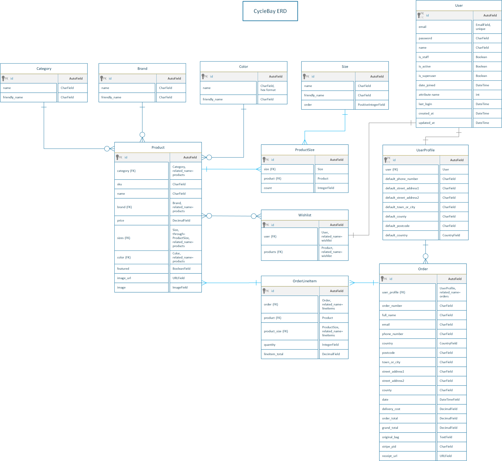

# CycleBay

TODO for app:
- Add favicon
- Create facebook page
- Add facebook page link to footer
- Add error pages
- Global context processor for wishlist
- Style navbar:
https://htmljstemplates.com/html/bootstrap-5-navbars?utm_content=cmp-true#:~:text=View%20Demo-,8.%20Ecommerce%20(Style%201),-Appropriate%20for%20an

## Overview
The CycleBay is a business to customer (B2C) e-commerce platform that allows customers to buy bicycles online. This is a full stack website built using the Django framework and uses the PostgreSQL database to store and manage data. The app is deployed on the Heroku cloud platform, uses the AWS S3 cloud service to store static files and utilizes the Stripe payment system to process payments.

Live Demo: https://cyclebay-bc1e75ddbf8e.herokuapp.com/


## Table of Contents

### Projects Goals
- Create a web application that allows users to buy bycicles online.
- Target people who love cycling ant are looking for a new bike.
- The app should allow users to find the bike they want quickly and easily.
- Implement responsive design to provide an optimal viewing experience across a wide range of devices.
- Provide a secure payment system.

### Marketing Strategy
CycleBay's overarching goal is to substantially increase sales and revenue. To achieve this, we are prioritizing product visibility by showcasing our range on digital platforms. Expanding our digital footprint through the creation and active management of our Facebook page will facilitate direct engagement with our target audience. Additionally, our strategic push on social media aims to grow our brand awareness, ensuring CycleBay becomes the go-to e-commerce platform for cycling enthusiasts.

#### Facebook Business Page

- [CycleBay - Facebook Business Page](https://www.facebook.com/)


[Back to top](#table-of-contents)

## Agile Methodology
The main goal of the app is to deliver a solution that creates real value for the users and _UX design_ and _Agile Methodology_ are the best way to achieve this goal.

### Development process
This project was developed with the Agile methodology which allowed me to develop the app iteratively and incrementally, and adapt changes with flexibility even in the late stages of development.

_GitHub Issues_ and _Projects_ are used to manage the development process.

The Project link: https://github.com/users/FlashDrag/projects/11

Each siqnificant feature is presented as an _Epic_ and then broken down into smaller _User Stories_ that are then added to the _Project Backlog_. _Epics_ are marked with labels to indicate the feature. It allows me to filter the _User Stories_ by feature and then allocate them to _Milestones_ and prioritize them.

The _GitHub__ Kanban_ board is used to manage the process and track the progress of the development. When _User Story_ is created, it is automatically added to the _Backlog_ column to be prioritized. The product _Backlog_ is never complete, as it is a dynamic document to respond to changes effectively. As new features are identified, they are added to the product _Backlog_. As the product is released, the product _Backlog_ is constantly updated to reflect changes in the product and changes in the market. The Kanban board includes the following columns:
- **Backlog** - the list of all _User _Stories_ that have not yet been scheduled to be completed. As new _User Stories_ are created, they are automatically added to the _Backlog_ column.
- **Sprint Backlog** - the collection of prioritized _User Stories_ that have been selected for the current _Sprint_.
- **Development** - the user stories that are currently being developed.
- **Testing** - user stories that are currently being tested.
- **Done** - all completed and tested _User Stories_.


The Project Table is used to filter and then allocate _User Stories_ to _Milestones_ and prioritize them. At the start of each sprint, the _User_ Stories_ are selected from the _Backlog_ and added to the _Sprint Backlog_ with attached priority labels.
The _User Stories_ prioritized using the _MoSCoW_ method. The prioritization was based on the following criteria:
- **Must Have** - The _User Story_ is crucial and add significant value to the product and must be delivered in the current iteration.
- **Should Have** - The _User Story_ is important but not critical to the success. Simply delivery is not guaranteed within the current iteration.
- **Could Have** - The _User Story_ is desirable and would only be delivered in their entirety in a best-case scenario. When a problem occurs and the deadline is at risk, one or more could-have items are dropped.
- **Won't Have** - The _User Story_ will not be delivered in the current delivery timebox but may be considered for the future.
The prioritization is based on the 60-20-20 rule where 60% of the effort is spent on the Must Have, 20% on the Should Have and the rest 20% on the Could Have. When the Sprint starts, the _User Stories_ are moved to the _Development_ column, where first the Must Have items. When the development of a particular _User Story__ is completed, it is moved to the _Testing_ column, tested and then moved to the _Done_ column manually or using the _commit_ message concerning the User Story ID. If the time is running out and the _User Stories_ are not completed, the Could Have items are dropped back to the _Backlog_ column for re-prioritization.

*GitHub Kanban Board*


*GitHub Project Table*


*Milestones*


[Back to top](#table-of-contents)


#### User Stories
#### Epic: Viewing and Navigation
- As a Shopper, I want to be able to see a home page so that I can quickly understand the purpose of the site and learn more about the business
- As a Shopper, I want to be able to easily navigate throughout the site to find content so that I can find what I'm looking for efficiently
- As a Shopper, I want to be able to view a list of bikes so that I can select one to purchase
- As a Shopper, I want to be able to view the details of a bike so that I can identify the price, color, type, size and image
- As a Shopper, I want to be able to quickly identify special offers so that I can take advantage of special savings on products I'd like to purchase
- As a Shopper, I want to be able to easily view the total of my purchases at any time so that I can avoid spending too much
#### Epic: Registration and User Accounts
- As a Shopper, I want to be able to easily register for an account so that I can have a personal account and be able to view my profile
- As a Shopper, I want to be able to easily login or logout so that I can access my personal account information
- As a Shopper, I want to be able to easily recover my password in case I forget it so that I can recover access to my account
- As a Shopper, I want to be able to receive an email confirmation after registering so that I can verify that my account registration was successful
#### Epic: User Profile and Purchases
- As a Shopper, I want to be able to have a personalized user profile so that I can view my personal order history and order confirmations, and save my payment information
- As a Shopper, I want to be able to save the products I want to buy later so that I can keep track of them
- As a Shopper, I want to be able to view my wish list so that I can see what I want to buy later
#### Epic: Sorting and Searching
- As a Site User, I want to be able to sort the list of available products so that I can easily identify the best-priced, categorically, brandly and colored products
- As a Shopper, I want to be able to sort a specific category of products so that I can find the best-priced product in a specific category or sort the products in that category by name
- As a Shopper, I want to be able to use filters so that I can sort multiple categories, brands, colors, price and sizes of products simultaneously
- As a Shopper, I want to be able to search for a product by name, brand or color so that I can find a specific product I'd like to purchase
- As a Shopper, I want to be able to easily see what I've searched for and the number of results so that I can quickly decide whether the product I want is available
#### Epic: Purchasing and Checkout
- As a Shopper, I want to be able to easily select the size and quantity of a bike when purchasing it, so that I can ensure I don't accidentally select the wrong bike, size or quantity
- As a Shopper, I want to be able to view bikes in my bag to be purchased, so that I can identify the total cost of my purchase and all items I will receive
- As a Shopper, I want to be able to adjust the quantity of individual items in my bag, so that I can easily make changes to my purchase before checkout
- As a Shopper, I want to be able to remove a Bike from my bag, so that I can remove it if I change my mind
- As a Shopper, I want to be able to easily enter my payment information so that I can check out quickly and with no hassles
- As a Shopper, I want to be able to feel my personal and payment information is safe and secure so that I can confidently provide the needed information to make a purchase
- As a Shopper, I want to be able to view an order confirmation after checkout, so that I can verify I haven't made any mistakes
- As a Shopper, I want to be able to receive an email confirmation after checking out, so that I can keep the confirmation of what I've purchased for my records
#### Epic: Newsletters
- As a Shopper, I want to be able to subscribe to a Newsletter so that I can receive any discounts or special offers available.
- As a Shopper, I want to be able to unsubscribe from the newsletter so that I can stop receiving emails from the store.
#### Epic: Store Management
- As a Store Owner, I want to be able to add a product to the store, so that I can sell it to customers.
- As a Store Owner, I want to be able to edit/update a product, so that I can change the price, description, image or any other attribute of the product.
- As a Store Owner, I want to be able to add a product category, so that I can group products into categories.
- As a Store Owner, I want to be able to delete a product, so that I can remove it from the store.
- As a Store Owner, I want to be able to delete a product category, so that I can remove it from the store.
- As a Store Owner, I want to be able to send a newsletter to subscribers, so that I can inform them about special offers or discounts.
- As a Store Owner, I need a Facebook page, so that I can promote my store on social media.

[Back to top](#table-of-contents)

## UX Design
### Structure
The CycleBay website is designed to be simple and easy to navigate. The site has a responsive design to provide an optimal viewing experience across a wide range of devices.

### Wireframes
The wireframes were created using [Balsamiq](https://balsamiq.com/). Here are some initial wireframes created at the beginning of the project. The final design may differ from the initial wireframes.

[Back to top](#table-of-contents)

### UI Design
#### Color Scheme
...


#### Typography

#### Styling

#### Images

[Back to top](#table-of-contents)

### Database Design
The Get Job platform uses a relational database to store and manage data. The RDBMS used for this project is [PostgreSQL](https://www.postgresql.org/) which is hosted on the cloud service [ElephantSQL](https://www.elephantsql.com/).

The ER Diagram below shows the structure of the database and the relationships between the tables. This diagram was created using [Microsoft Visio](https://www.microsoft.com/en-ie/microsoft-365/visio/).



[Back to top](#table-of-contents)

## Features
### Existing Features
#### User Authentication and Authorization
- [ ] User Registration
- [ ] User login with email confirmation(temporarily disable in settings.py)
- [ ] User logout

#### User Profile
- [ ] Order history
All ordered item details additionally stored in json format in the Order model in original_bag field. This allows to display the items in the order history even without reference to the Product model. So the user can see the ordered product details even if the product was deleted from the store. Its kind of a snapshot of the product at the time of purchase. Here is the list of the saved product details:
product id, product name, product size id, size, quantity, price, color.

- [ ] Order email confirmation
- [ ] Save delivery information
- [ ] Wish list

#### Store Management
- [ ] Add product
- [ ] Edit product
- [ ] Delete product

<!-- TODO: dynamic categories. owner can add new category. it will be displayed in navbar dropdown menu -->
<!-- TODO: dynamic colors. they use own model -->
<!-- TODO: dynamic sizes -->
#### List of Products
- [ ] All products
- [ ] Categories
Dynamic categories. owner can add new category. it will be displayed in navbar dropdown menu
- [ ] Special offers

#### Product Details
- [ ] Product category(clickable)
- [ ] Product price
- [ ] Product image
- [ ] Product Description
- [ ] Product sizes
- [ ] Add to bag button

#### Search
- [ ] Search by keywords in the product name and description

#### Sorting
- [ ] Sort by price (ascending and descending)
- [ ] Sort by rating (ascending and descending)
- [ ] Sort by name (ascending and descending)
- [ ] Sort by category (ascending and descending)

#### Shopping Bag
- [ ] Add product to bag
- [ ] Remove a product from the bag
- [ ] View bag
- [ ] Countdown timer and auto remove products from the bag after the timer expires
- [ ] View and adjust the number of each product in the bag
- [ ] View a subtotal cost of each product in the bag
- [ ] Delivery calculation
- [ ] Grand total

#### Checkout (Stripe)
- [ ] Checkout form with delivery information
As I'm dealing with stock quantities, I used `transaction.atomic` and `select_for_update` to prevent race conditions and
ensure that the stock quantity is updated correctly. All rows with `select_for_update()` method (in this case, the `product_size_obj` rows) are fetched are locked for the duration of the transaction, which is in the `transaction.atomic()` block. Once the transaction is committed, the lock is released, and other transactions can access the locked rows. If an exception occurs within the `transaction.atomic()` block, the transaction will be rolled back, and the lock will also be released.

```
@require_POST
def cache_checkout_data(request):
    # ...
    with transaction.atomic():
        try:
            for item in current_bag["bag_items"]:
                # select_for_update allows to lock the selected
                # product size to prevent race conditions until
                # the transaction is complete
                product_size_obj = ProductSize.objects.select_for_update().get(
                    id=item["product_size_id"]
                )
                # update the product size count in stock using F() expression
                product_size_obj.count = F("count") - item["quantity"]
                product_size_obj.save()
    # ...
```

- [ ] Card payment
- [ ] Email confirmation
- [ ] Order history
If not authenticated user made an order for existing email, the order will be added to the order history of the user with this email.

#### Newsletter
- [ ] Subscribe to newsletter

[Back to top](#table-of-contents)

### Future Features
...

[Back to top](#table-of-contents)

### Development Features
...

[Back to top](#table-of-contents)

## Database
The app uses a relational database service [ElephantSQL](https://www.elephantsql.com/) to store and manage data.

*Database Configuration*
```
development = os.getenv('DEVELOPMENT', False) == 'True'

if development:
    DATABASES = {
        'default': {
            'ENGINE': 'django.db.backends.sqlite3',
            'NAME': BASE_DIR / 'db.sqlite3',
        }
    }
elif len(sys.argv) > 0 and sys.argv[1] != 'collectstatic':
    if os.getenv("DATABASE_URL", None) is None:
        raise Exception("DATABASE_URL environment variable not defined")

    import dj_database_url
    DATABASES = {
        'default': dj_database_url.config(
            default=os.getenv('DATABASE_URL')
        )
    }
```

*ElephantSQL Instance*


[Back to top](#table-of-contents)

## Static Files
The static files are hosted on the cloud service [AWS S3](https://aws.amazon.com/s3/).

*AWS S3 Bucket*


[Back to top](#table-of-contents)

## Technologies Used
### Languages
- [HTML5](https://en.wikipedia.org/wiki/HTML5)
- [CSS3](https://en.wikipedia.org/wiki/CSS)
- [JavaScript](https://en.wikipedia.org/wiki/JavaScript)
- [Python](https://en.wikipedia.org/wiki/Python_(programming_language))
### Frameworks, Libraries
- [Django 3.2](https://docs.djangoproject.com/en/3.2/)
- [Celery 5.3.4](https://docs.celeryproject.org/en/stable/)
- [Bootstrap 5](https://getbootstrap.com/docs/5.3/getting-started/introduction/)
- [jQuery 3.6.4](https://releases.jquery.com/)
- [Font Awesome 6.4](https://fontawesome.com/)
- [Stripe](https://stripe.com/docs)
### Tools
- [Redis](https://redis.io/)
- [Git](https://git-scm.com/)
- [GitHub Actions](https://docs.github.com/en/actions)
- [Adobe Photoshop](https://www.adobe.com/ie/products/photoshop.html)
- [Microsoft Visio](https://www.microsoft.com/en-ie/microsoft-365/visio/)
- [Google Fonts](https://fonts.google.com/)
- [Heroku](https://www.heroku.com/)
- [AWS S3](https://aws.amazon.com/s3/)
- [Balsamiq](https://balsamiq.com/)
- [Sass](https://sass-lang.com/)
- ### Django packages
- [django-crispy-forms](https://django-crispy-forms.readthedocs.io/en/latest/)
- [cripsy-bootstrap5](https://github.com/django-crispy-forms/crispy-bootstrap5)
- [django-allauth](https://django-allauth.readthedocs.io/en/latest/)

## Testing
See [TESTING.md](https://github.com/FlashDrag/cyclebay/blob/master/docs/TESTING.md) for an overview of the app testing and debugging.

[Back to top](#table-of-contents)

## Deployment, CI/CD
The Get Job platform is deployed on the [Heroku](https://www.heroku.com/) cloud platform and can be accessed here https://cyclebay-bc1e75ddbf8e.herokuapp.com/


### Local Deployment for Ubuntu
#### Requirements
To run this project locally, you will need the following tools:
- [Git](https://git-scm.com/)
- [Python 3](https://www.python.org/)
- [PIP](https://pypi.org/project/pip/)
- [Virtualenv](https://virtualenv.pypa.io/en/latest/) and [Virtualenvwrapper](https://virtualenvwrapper.readthedocs.io/en/latest/)
- [Redis](https://redis.io/)

#### Instructions
1. Clone the repository
```
git clone
```
2. Create a virtual environment
```
# mkvirtualenv <name> <path_to_project>
$ mkvirtualenv cyclebay .
```
3. Activate the virtual environment
```
$ workon cyclebay
```
4. Install the project dependencies
```
pip install -r requirements.txt
```
5. Create a .env file in the root directory and add the environment variables from the .env_example file
```
6. Run Redis
```
redis-server
```
7. Run the app
```
python manage.py runserver
```
8. Run Celery
```
celery -A cyclebay worker -l info
```

## Credits

### Content
- [Person Riding Bicycle](https://www.pexels.com/photo/person-riding-bicycle-2924491/) by [SAurabh Narwade](https://www.pexels.com/@daredevil/)
- [Man Riding Bicycle](https://www.pexels.com/photo/photo-of-man-riding-bicycle-2989567/) by [Josh Hild](https://www.pexels.com/@josh-hild-1270765/)

## Contacts
If you have any questions about the project, or you would like to contact me for any other reason, please feel free to contact me by email or via social media.

[](mailto:flashdrag@gmail.com)

[](https://t.me/flashdrag) [](https://www.linkedin.com/in/pavlo-myskov)

[Back to top](#table-of-contents)