# TESTING

## Contents
...
- [Back to README.md](../README.md#table-of-contents)

## Python - Flakes8 Validation
The Flake8 linting tool is used to identify code-quality issues and check the Python code for PEP8 requirements.

In some cases, the Flake8 validation was ignored for a specific line of code. This was done by adding a `# noqa` comment at the end of the line.

The following Flake8 errors were ignored:
- F401: Imported but unused. Added to unsused imports in files that was generated by Django, but not used in the project.
- E501: Line too long. Added to lines that was too long, but not possible to split into multiple lines, or where it would make the code less readable.
- exlude: `migrations` folders. Added to exclude the migrations folders, as they are generated by Django.

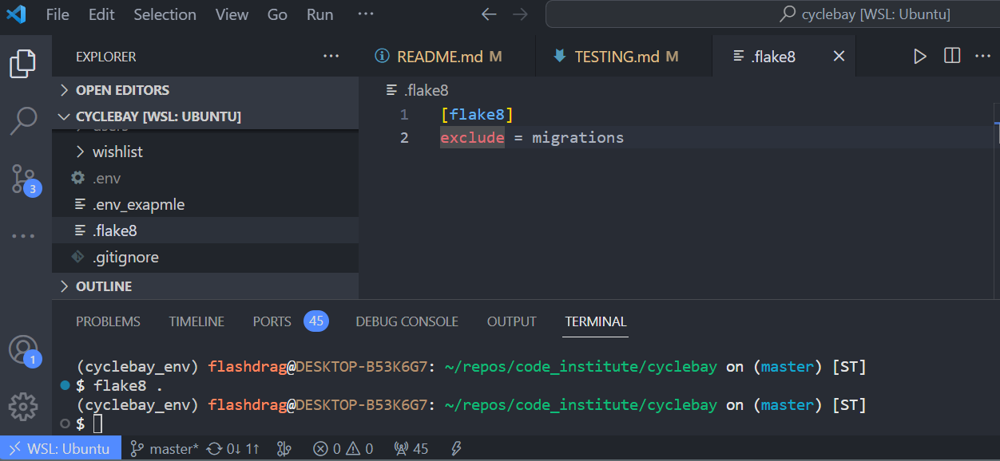

[Back to top](#contents)

## JavaScript Validation
The JavaScript separate files were validated using [JSHint](https://jshint.com/).

*checkout/stripe_elements.js*
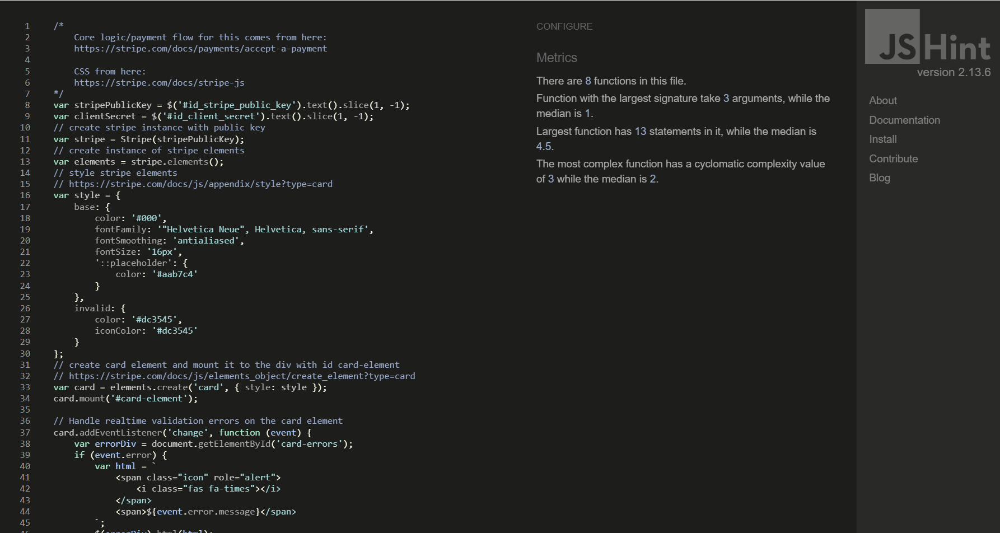

*inventorize/collapse_elements.js*
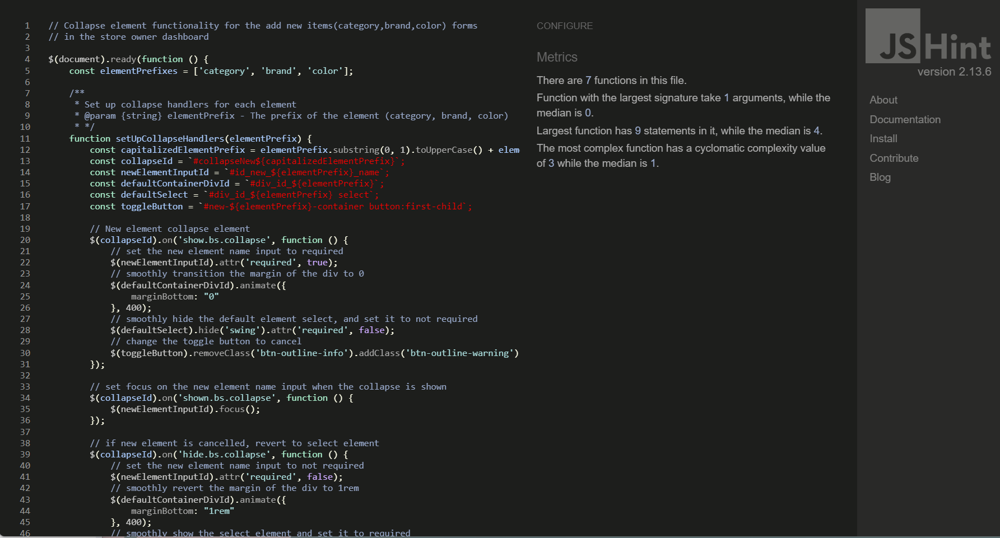

*profiles/countryfield.js*
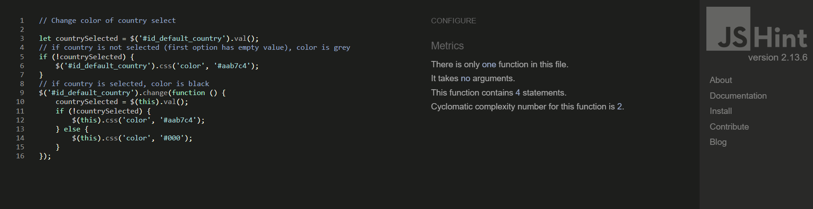

*wishlist/wishlist_toggler.js*
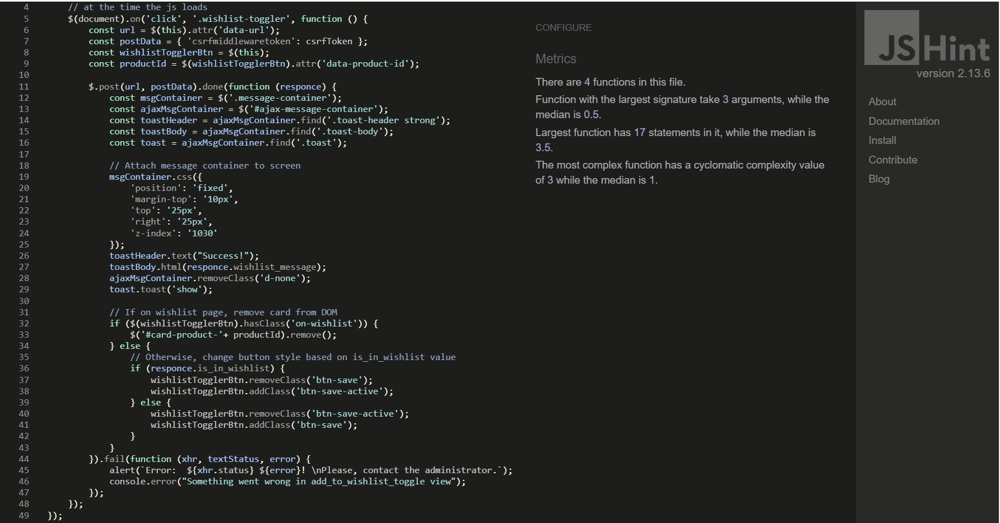

[Back to top](#contents)

## HTML Validation
The HTML markup was validated using [W3C Markup Validation Service](https://validator.w3.org/). Since the Django templating language was used, the validation was done on the public rendered HTML pages, that not required a user to be logged in.

*Home Page*
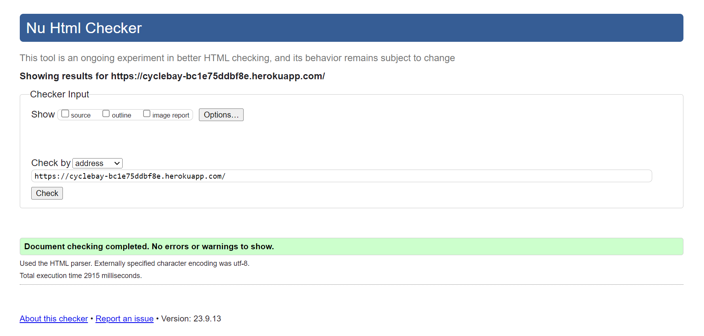

*Products Page*
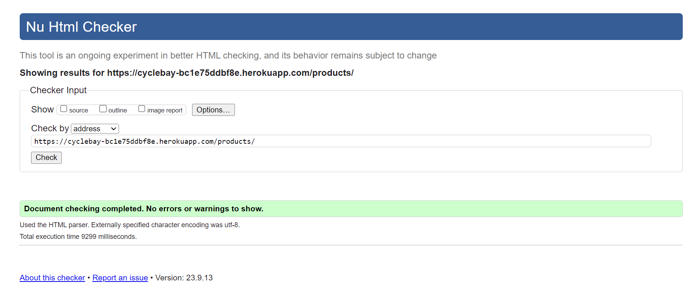

*Product Detail Page*
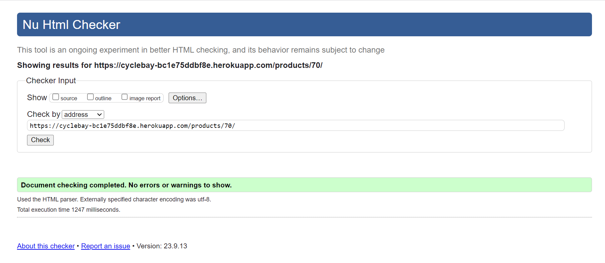

*Featured Products Page*

*Login Page*
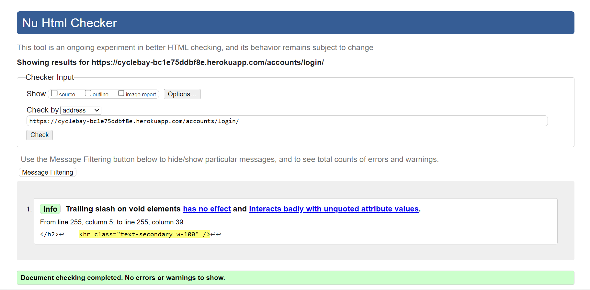

*Register Page*
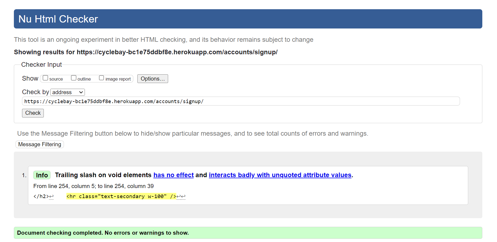

*Empty Bag Page*
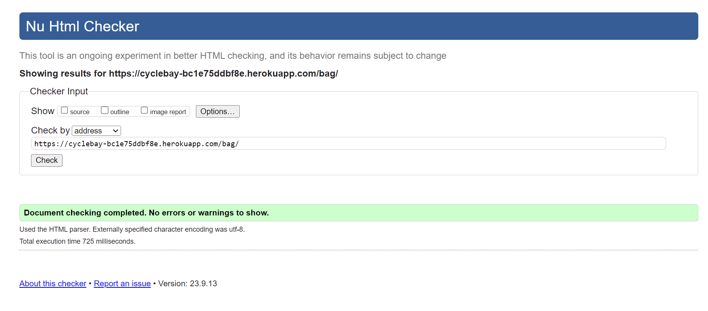

*Contact Page*
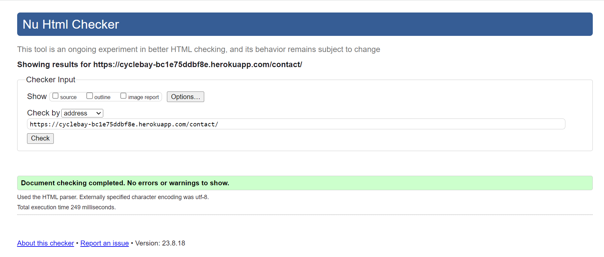

[Back to top](#contents)

## CSS Validation
To validate the CSS code I used the [Jigsaw](https://jigsaw.w3.org/css-validator/) css validator.

*checkout.css*

*home.css*
There are 4 parse errors in the home.css file, since the `:has()` pseudo-class is part of a level 4 selectors draft and is not yet supported by the validator.

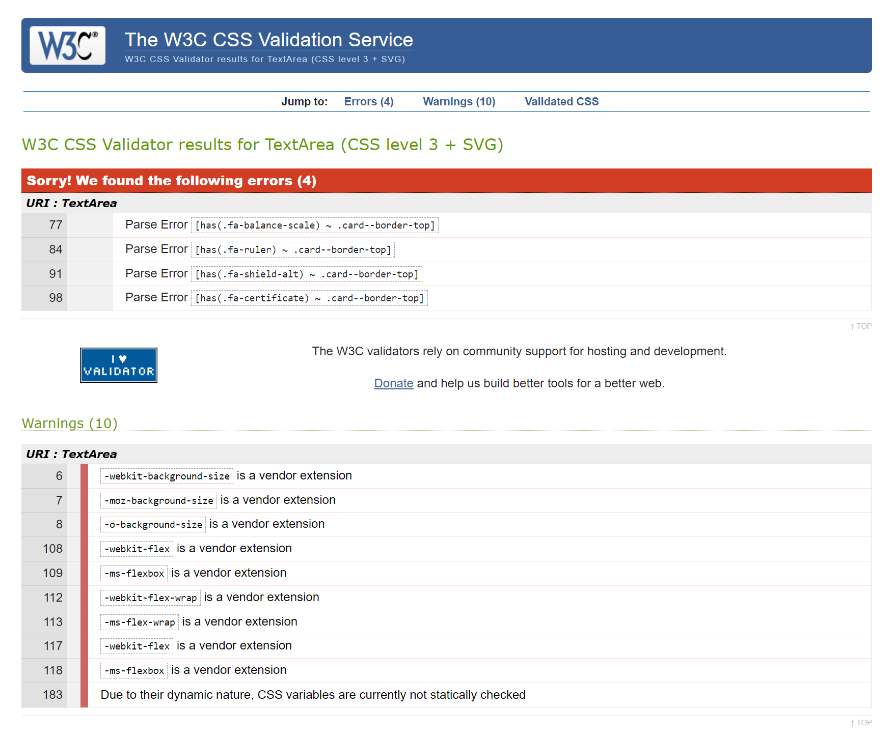

*inventorize.css*
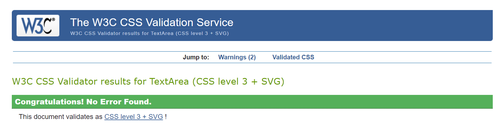

*profile.css*
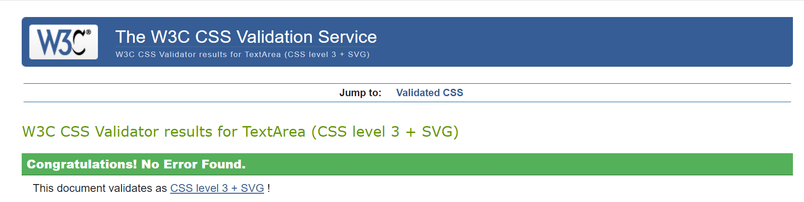

*base.css*

## Lighthouse Testing
The [Google Lighthouse](https://developers.google.com/web/tools/lighthouse) tool was used to check the performance, accessibility, best practices, and SEO of the website. The tests were run on the deployed website.

### Desktop
*Home Page*
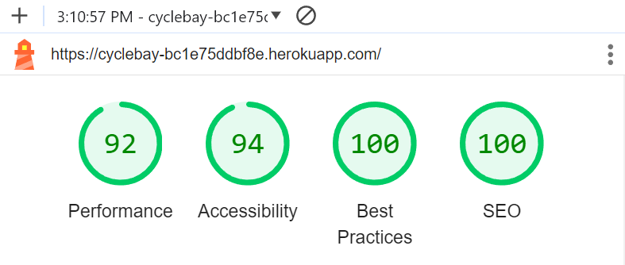

*Products Page*
<small>To enhance the performance of the products page, I plan to implement pagination to limit the number of products loaded at once. Given that the products page features various types of sorting and filtering options, which complicate the implementation of pagination, I have decided to postpone this feature to a future update.</small>

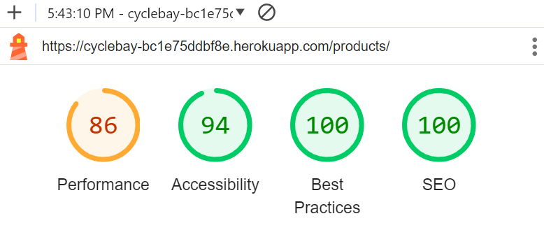

*Product Detail Page*
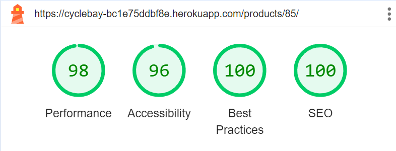

*Empty Bag Page*
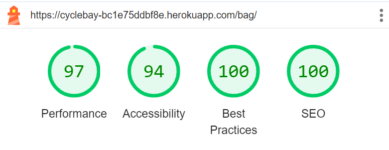

*Bag Page with Products*
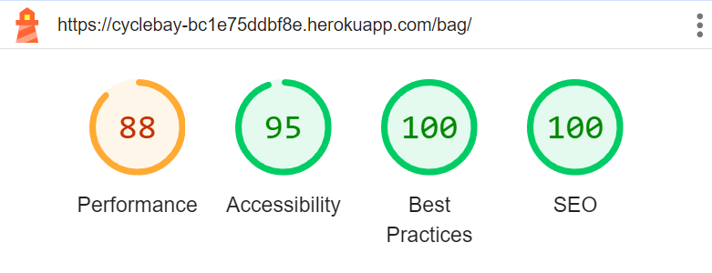

*Checkout Page*
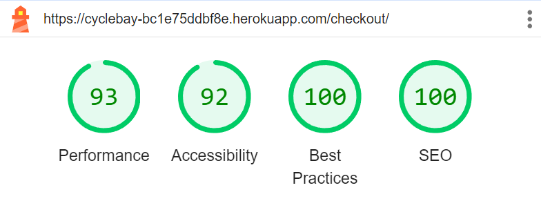

