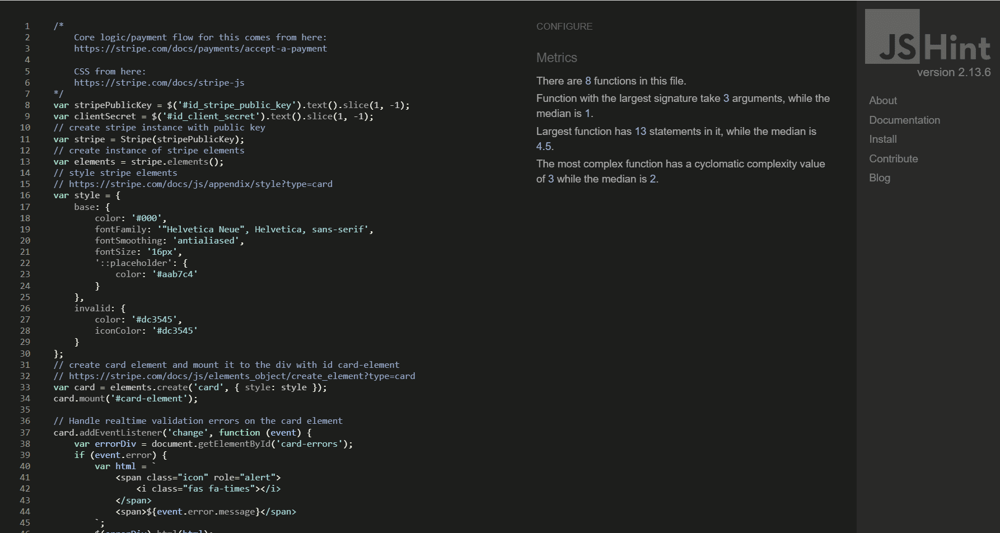
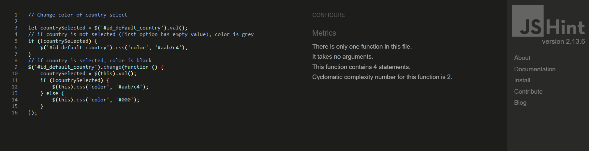
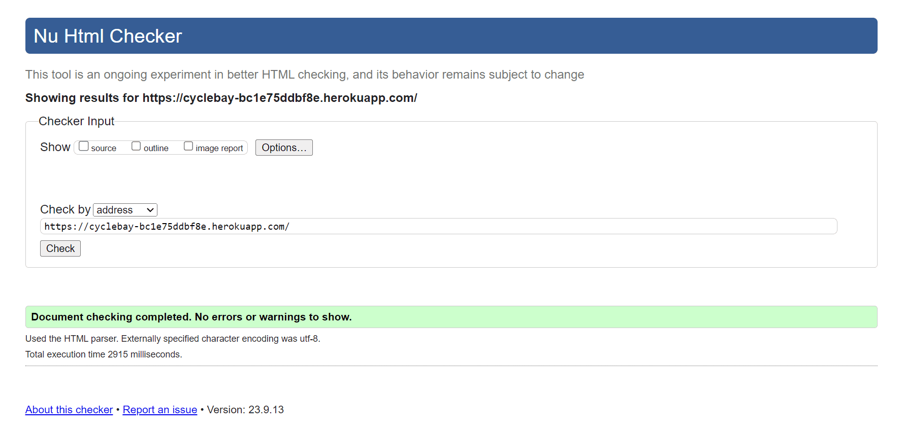
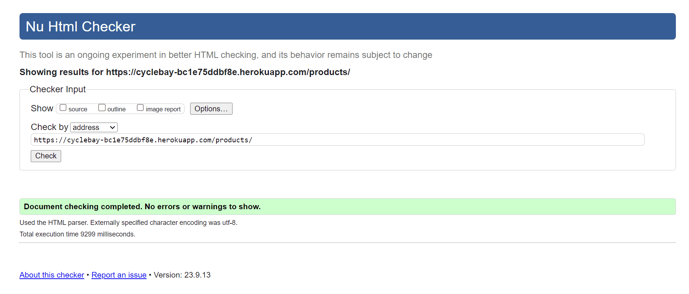
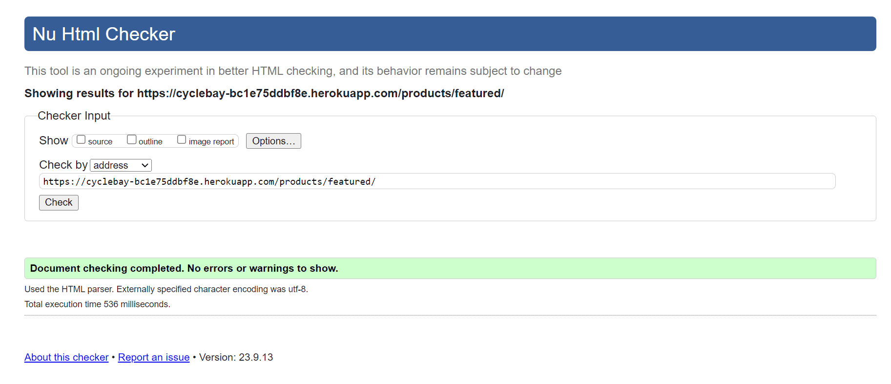
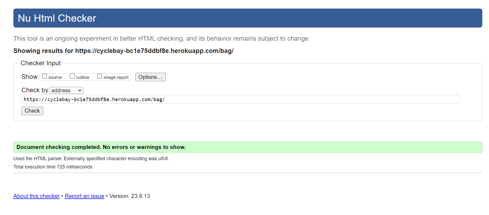
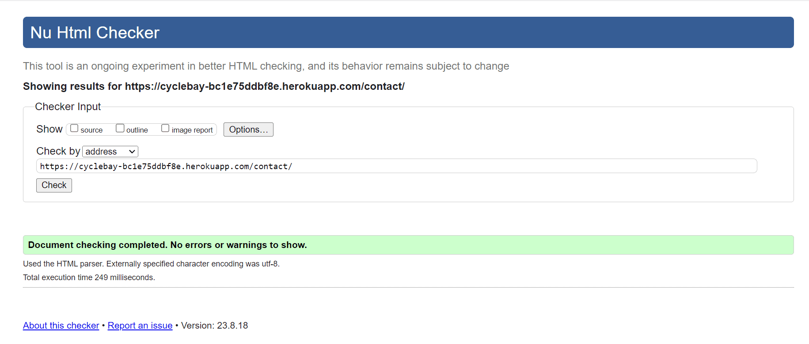

# TESTING

## Contents
...
- [Back to README.md](../README.md#table-of-contents)

## Python - Flakes8 Validation
The Flake8 linting tool is used to identify code-quality issues and check the Python code for PEP8 requirements.

In some cases, the Flake8 validation was ignored for a specific line of code. This was done by adding a `# noqa` comment at the end of the line.

The following Flake8 errors were ignored:
- F401: Imported but unused. Added to unsused imports in files that was generated by Django, but not used in the project.
- E501: Line too long. Added to lines that was too long, but not possible to split into multiple lines, or where it would make the code less readable.
- exlude: `migrations` folders. Added to exclude the migrations folders, as they are generated by Django.

[Back to top](#contents)

## JavaScript Validation
The JavaScript separate files were validated using [JSHint](https://jshint.com/).

*checkout/stripe_elements.js*

*inventorize/collapse_elements.js*

*profiles/countryfield.js*

*wishlist/wishlist_toggler.js*

[Back to top](#contents)

## HTML Validation
The HTML markup was validated using [W3C Markup Validation Service](https://validator.w3.org/). Since the Django templating language was used, the validation was done on the public rendered HTML pages, that not required a user to be logged in.

*Home Page*

*Products Page*

*Product Detail Page*

*Featured Products Page*

*Login Page*

*Register Page*

*Empty Bag Page*

*Contact Page*

